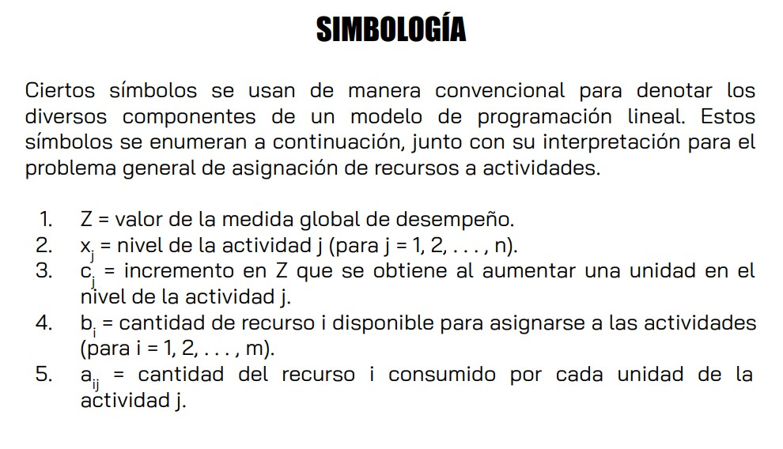
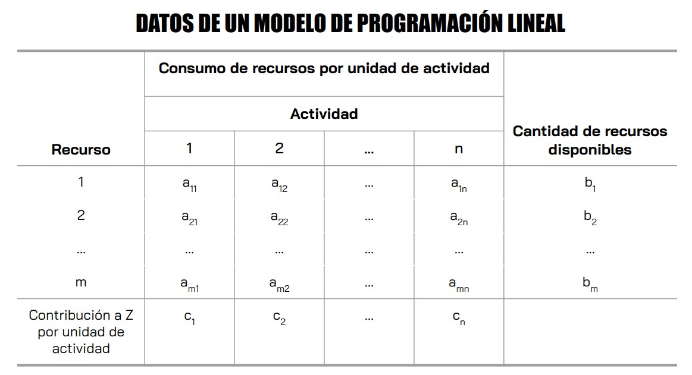
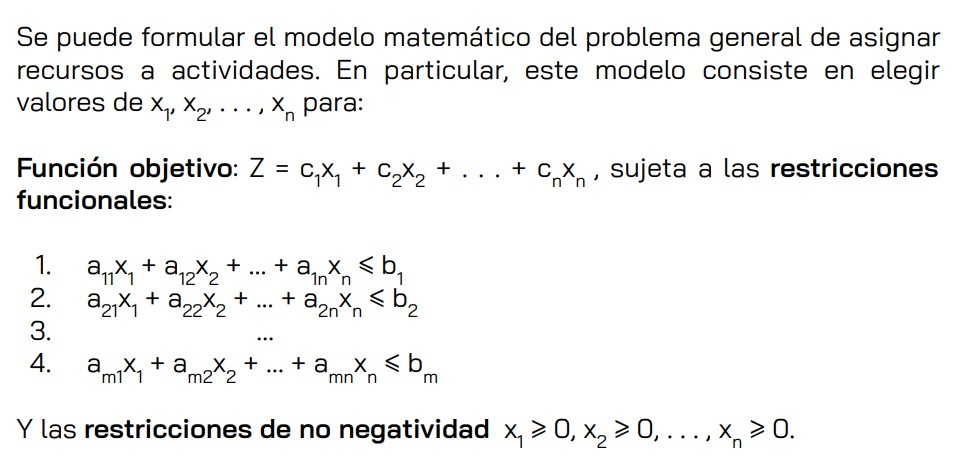
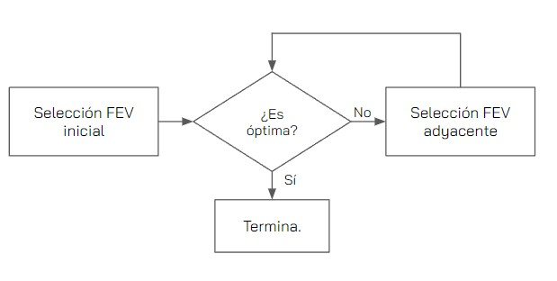
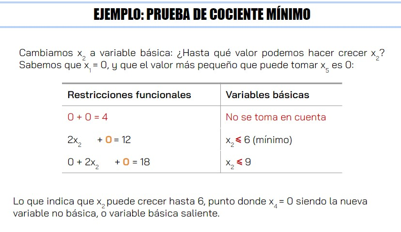
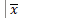

# Investigación de Operadores

1. ¿ Qué elementos componen un modelo?

* Función objetivo (Z)
* Variables de decisión (x1, x2, ...)
* Restricciones (x1 > 0, ...)

2. ¿ Qué tipo de modelos existen?

* Estático y dinámico: Un solo periodo y más de un solo periodo de tiempo.
* Lineal y No lineal: Con función objetivo lineal o no lineal.
* Entero y No entero: Variables de decisión enteras o no enteras.
* Determinístico y estocástico: Es cuando para cualquier valor de las variables de decisión, se conoce con certeza el valor de la función objetivo y si las restricciones se cumplen o no. Suelen ser aproximaciones de modelos
    reales pero dan información muy valiosa..

3. ¿Qué tipos de programación existen?

* Lineal.
* Entera.
* Red.
* Dinámica.
* No Lineal.

4. Mencione los 7 pasos para construir un Modelo.
  **Plantear** el problema-Reunir **información** para estimar el valor de parámetros que afectan el problema-**Elaborar** el modelo-**Revisar** si el modelo se acopla a la realidad-
  **Seleccionar** el modelo adecuado-**Presentar** el modelo-Ponerlo en **marcha** y **evaluarlo**.

# Método Gráfico



0. Crear una tabla de restricciones con los datos proporcionados por el problema.
  
1. Identificar los valores de las variables de decisión que son permitidos por las restricciones del problema.
  
    * Dibujar la recta de cada restricción usando las intersecciones con 0 cero de ambas variables de decisión.
2. Dibujar la región factible. Esta región debe de ser un area que cubren todas las restricciones al mismo tiempo.
3. Obtener los puntos de Intersección entre las rectas que estén en la región factible.
4. Probar todos los puntos vértice dentro de la región factible en Z. El **menor** será la solución factible que **minimiza Z**, el **mayor** el que la **maximiza**.

## Casos posibles al realizar Programación Lineal

### Más de una solución óptima factible o Infinitas soluciones

Gráficamente se puede ver como un segmento entero que está delimitado por una recta cuyos puntos dan lo mismo en Z.

### No tiene solución factible

1. No tiene soluciones factibles (que entren en la región factible).
2. Va hacia el infinito y por ende mejora de forma constante (falta de restricciones).

* ``Soluciones FEV: Factibles En los Vértices (Esquinas de la región factible) -También se les conoce como esquinas o puntos extremos de la región factible-``

## Supuestos

1. **Proporcionalidad**: La contribución de cada actividad es proporcional (en Z) al nivel de actividad x_j. Por eso a_ij*x_j. Por ende los problemas solo pueden ser lineales.
2. **Aditividad**: C/a función del modelo es la suma de las constribuciones individuales de las actividades respectivas.
3. **Divisibilidad**: Las variables de desición pueden tomar cualquier valor real, siempre y cuando cumplan con las restricciones.
4. **Certidumbre**: Los valores asignados a cada parámetro son conocidos con certeza.

--------------------------------------------------------

# Simplex

* **Flujo Simplex**:
  

* **Prueba de Optimalidad**:

  ```
  Se sabe que se ha llegado a la solución óptima cuando los FEV adyacentes tienen no mejoran al FEV "actual". Fuera de la forma gráfica en la forma algebraica se puede hacer la prueba revisando al estado de los coeficientes de Z:
  1. Maximizar: En Z todos son negativos o cero (quiere decir que ya no es posible encontrar un aumento mejor).
  2. Minimizar: En Z todos son positivos o cero (quiere decir que ya no es posible encontrar una disminución mejor).
  ```

* **Seleccionar el origen**:

  ```
  Gráficamente es elegir el punto (0,0) para las variables (x1,x2) por ejemplo, osea que estas sean la solución inicial.
  ```

## Método Simplex algebraico

### Pasos

1. Tomamos a todas las restricciones y les agregamos **variables de holgura** (se pueden representar como un x_n ó como s_n), esto para poder convertir las desigualdades en igualdades. Estas variables nos permiten tener una **forma estándar** en la que todas las restricciones son igualdades.
      * **Solución aumentada**: Es una solución de las variables originales (las variables de decisión) que se aumentó con los valores correspondientes de las variables de holgura.
      * **Solución básica**: Solución en un vértice aumentada.
      * **Básica factible**: Solución FEV aumentada.
      * ```Z no se aumenta(no incluye holguras) porque ya es una igualdad.```
2. "Distribuir" entre **Básicas** y **No Básicas** las variables. Inicialmente se tiene que las Básicas serán las variables de holgura y las no básica serán las variables de decisión.
   * **Truco** para saber cuántas variables poner como No Básicas:
    ```Grados de libertad = cantidadDeVariables - cantidadDeRestricciones.```
    * Las variables **No Básicas** son iguales a **cero**.
3. Se ponen las **restricciones y Z en términos No Básicos**.

   ```
   Z = VALOR_DE_Z + c_1x_NB1 + c_2x_NB2 + ... + c_nx_NBn
   x_B1 = VALOR_DE_LA_VAR_BÁSICA1 + c_1x_NB1 + c_2x_NB2 + ... + c_nx_NBn
   ```

4. Se realiza la prueba de optimalidad revisando si en Z se llegó a una solución óptima. Si no es el caso entoces se toma la variable que más aumente(maximizar) o disminuya(minimizar) a Z para que entre a la base.
5. Para elegir a la variable que saldrá de la base se comparan las restricciones y se toma la variable en que la entrante tiene un valor mayor(otra opción sería la prueba del cociente mínimo). Vuelva al paso **3**
   * Cociente mínimo: 

## Método Simplex tabular

1. Se toman los pasos 1 y 2 del anterior, pero ahora se mete en una tabla con la siguiente forma:
  
  ||Z|x1|x2|...|xn|s1|s2|...|sm|Lado derecho|
  |-|-|-|-|-|-|-|-|-|-|-|
  |Z|
  |VB1|
  |VB2|
  |...|
  |VBn|

  ```Es importante notar que la columna de Z nunca cambia en la tabla pues siempre se mantiene como variable básica, entonces podríamos no incluirlo.```

2. **Elegir al elemento pivote**: Es la intersección en la tabla de la fila y columna pivote. La columna será la que tiene al valor que más aumenta(maximizar) o disminuya(minimizar) a Z y la fila se encuentra dividiendo a los valores del Lado derecho entre los valores de la col. pivote, el menor de todos al dividir será la ubicación de la fila pivote.
3. Cada iteración busca eliminar (convertir a cero) a los valores de la columna pivote. Esto mediante operaciones entre filas. Se toma la fila en que se encuentra el valor a "eliminar" y se le suma la fila del elemento pivote multiplicada por algún número que haga que R_valorAEliminar + R_pivote*número = 0. De ahí la importancia del elemento pivote, pues ese se encarga de eliminar al objetivo.
4. Tras cada iteración se representa la entrada del una variable a la base. Esto se hace multiplicando por la fila pivote un número que procese al elemento pivote (lo convierta en 1).
5. Finalmente, se realiza la prueba de optimalidad, y si no se ha llegado a la solución óptima volvemos al **paso 2**.

* ```¿Qué pasa si hay empate al elegir la columna o fila pivote?``` Elija arbitrariamente.
* ```¿Cómo deben verse las variables Básicas en la tabla?``` Sus columnas solo contienen ceros y un solo 1, estas son las únicas que tiene el valor de cero dentro de la fila Z.
* ```¿Cómo se ve cuando se tienen múltiples soluciones?``` Una variable No Básica tiene el valor de 0 en la fila Z.
* ```¿Qué hago si hay un ciclo infinito en que la fila Z no cambia?``` Esto rara vez ocurre, pero es posible que si ocurriera es porque si hubo un empate al elegir la columna pivote elegimos arbitrariamente puede que no haya continuación, en ese caso solo elija la otra variable, eso posiblemente lo solucione.

## Gran M
Es lo mismo que el método tabular pero aplicando ciertas cosas en las restricciones y sobre Z.
* Para restricciones **<=** : Solo se suma una variable de holgura al lado izquierdo para convertirlo en igualdad.
* Para restricciones **=**: se suma una **variable artificial** (denotada como a_n ó _n) al lado izquierdo.
* Para restricciones **>=**: Se resta la variable de exceso (antes holgura) y a eso se le suma una variable artificial.
* **En Z**: Se suman las variables artificiales utilizadas en las restricciones, multiplicadas por un gran número M.
  * ```M es un número cualquiera, el cual es MUY GRANDE.``` Tiene que ser muy grande para desaparecer con el proceso tabular.
  
### Pasos
Los pasos son los mismos que en el método tabular, con la diferencia de que tenemos que eliminar las M "iniciales" de la fila Z. Después de esto se hace lo mismo que en el método tabular.

## Dos fases

Aquí se hace lo mismo que en el método de Gran M, solo que no se añaden las M a Z. En vez se hace un "Z auxiliar" llamado r. r incluye únicamente a las variables artificiales sumadas.

### Fase 1
1. Se introducen las restricciones y r a la tabla Simplex.
2. Se eliminan las variables artificiales de r.
3. ```Se minimiza r```.

### Fase 2
1. Una vez minimizado r se quitan las columnas de las variables artificiales de la tabla y se sustituye la fila de r por Z.
2. Se eliminan los coeficientes que hacen que las variables básicas no sean cero en la fila Z.
3. Si aún no se llega a la solución óptima, entonces a partir de la tabla que se tiene se hace el proceso simplex sobre la tabla hasta llegar a él.