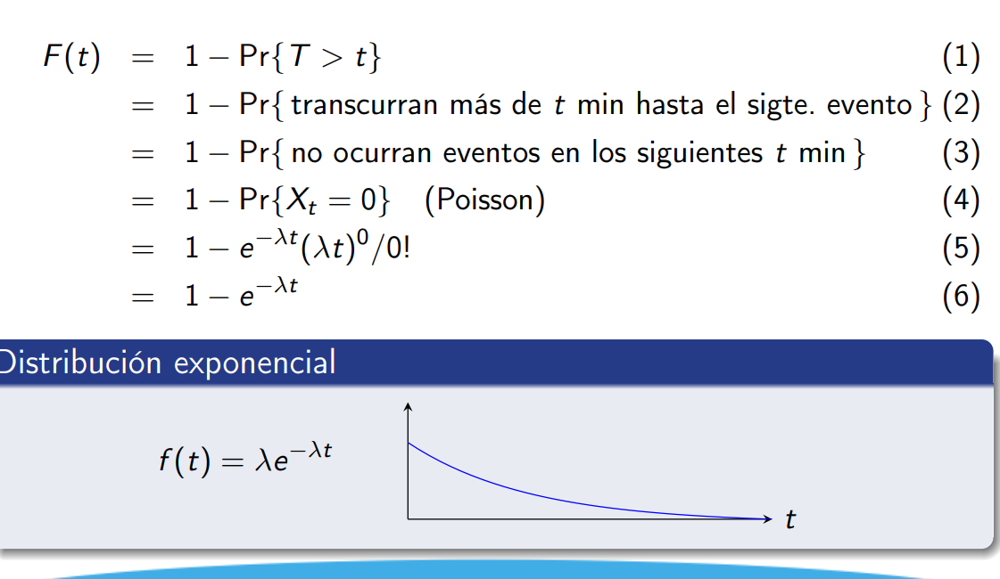
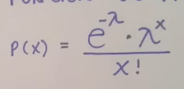
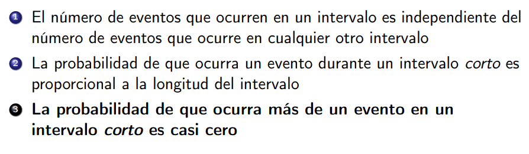
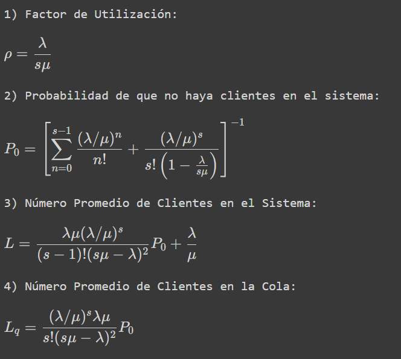
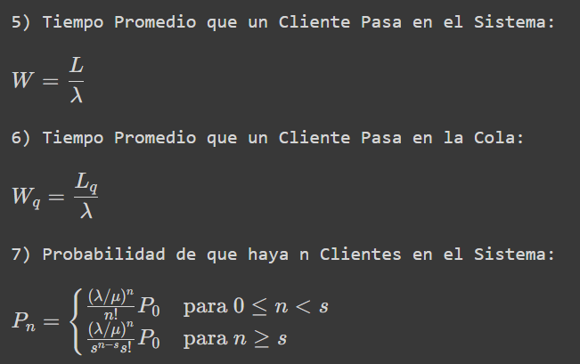
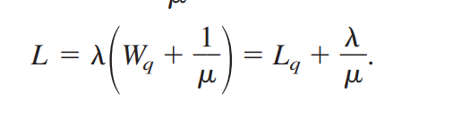

# Teoria

M/M/_: 
<Distr. tiempos de llegada>/<Distr. de tiempos de serv.>/<server_count>
* M: Distr. Poisson en tiempo Exp.

### Exp. (continua)

### Poisson (discreta)



## Fórmulas M/M/s




## Minimizar algo : C_t = C_s*s + C_w*L

# Tools

```py
def loi_exponentielle(n, lmbda):
  # Crea n tiempos de llegadas
  y = np.random.uniform(0, 1, n)
  # Los distribuye exponencialmente
  x = [-np.log(1 - y[i]) / lmbda for i in range(len(y))]
  return x
```

```py
def mm1(arrivees, services):
  n = len(arrivees)
  # Primer cliente
  sorties = [arrivees[0] + services[0]]
  # Clientes sucesivos
  for i in range(1, n):
    # Si este cliente llegó después que el anterior
    if sorties[i - 1] > arrivees[i]:
      # Espera al anterior y luego se tarda su tiempo
      # de servicio
      sorties.append(sorties[i - 1] + services[i])
    else:
      # Solo espera su tiempo de servicio porque no 
      # llegó después que el anterior
      sorties.append(arrivees[i] + services[i])
  return sorties
```

## import numpy as np
```py
np.log -> In(x)
```

## matplotlib.pyplot as plt

## import simulus
```py
class simulus.simulator.simulator(name=None, init_time=0)
sim = simulus.simulator # object sim
sim.process(<function>, until=<time>) 
sim.process(<fucntion>, offset= <time_duration_for_run>)
sim.run(<time in secs>)

sim.now # time right now
// offset es el tiempo relativo en el que debe de pasar ese evento
// until es el tiempo definitivo en que pasará en evento
// repeat_intv es el intervalo de tiempo en que se repite el evento.
sim.sched(fun, for_fun_args(list, args), offset, until, name, repeat_intv, kwargs)

cancel(<sched() ret val>)

rng() -> retorna un instancia de un generador de números pseudo-aleatorios.
```
# import scipy.stats as stats, from qmodels.rng import expon
expon(mean, seed)
stats.poisson.pmf(x_0, mean)

# from collections import deque

# From list
.mean() and .std()