# **Error conocido**: Hay preguntas y conceptos del Cap2 en la parte de Cap1. :(

---------------------------

# Cap 1

## Conceptos 1

* **Programa de arranque(bootstrap):** Toda compu tiene uno, se encarga de
  iniciar todo aspecto de l sistema, el SO, inicializar los registros del CPU, drivers
  de los I/O, etc. Se suele guardar en el firmaware del hardware.
* **Demonio(daemon),servicio o subsistema del sistema**: Son servicios(procesos) del sistema
  que no están en el Kernel, se ejecutan en **tiempo de arranque**.
  Corren durante el tiempo que esté el Kernel.
* **Interrupciones y Excepciones/trampas**: Las Excepciones son Interrupciones
  que ocasionan el Software de usuario, ya sea por algúnm error o por
  alguna acción del usuario. de aquí vienen los **System Call**.
* **Proceso**: Ejecución de un programa en CPU en un Sistema **Multiprogramado**
* **Intrucción privilegiada**: Son intrucciones que solo se ejecutan
  en modo Kernel, si se intenta hacer una de estas en modo Usuario,
  el hardware la atrapa en el SO. Ej: Manejo de tiempo, Interrupciones,
  control de I/O, etc.
* **Vector de syscalls**: Las API guardan en una lista los syscall.
  Entonces su uso se hacer indexando el número de syscall.
* **Aros de protección**: Así se le llama a los modos en un
  sistema multimodos.
* **Drivers de dispositivos**: Normalmente, los sistemas operativos tienen un controlador de dispositivo para cada controlador de dispositivo. Este controlador de dispositivo entiende el controlador de dispositivo y proporciona al resto del sistema operativo una interfaz uniforme para el dispositivo. La CPU y los controladores de dispositivo pueden ejecutarse en paralelo, compitiendo por ciclos de memoria. Para garantizar un acceso ordenado a la memoria compartida, un controlador de memoria sincroniza el acceso a la memoria.
* **Vector de interrupciones**: Ya que se tiene que hacer bastante seguido interrupciones, el sistema tiene un vector de interrupciones en las posiciones bajas de la memoria, este vector contiene las direcciones de las rutinas de servicio de interrupciones para el dispositivo que intenta interrumpir.
* **Encadenamiento de interrucpiones**: Cada elemento del vector de interrupciones apunta a una lista de manejadores de interrupciones. Se llama uno por uno a los manejadores hasta que se encuentra el servicio que se pidió al interrumpir.
* **Núcleo(core)**: Componente de CPU que se encarga de ejecutar instrucciones y registros para guardar datos localmente.
* **CPU**: Hardware que ejecuta instrucciones.
* **Procesador**: Chip físico que contiene uno o más CPUs.
* **Núcleo(core)**: Unidad básica de computación(cálculos) del CPU.
* **NUMA (non-uniform mem. access)**: Cuando todos los CPUs comparten espacio de mem. física.
* **Middleware**:  Frameworks de software que ofrecen servicios adicionales a los desarrolladores, como los que se encuentran en los sistemas operativos móviles más destacados, como iOS de Apple y Android de Google. Estos sistemas incluyen un núcleo central y un software intermedio que respalda diversas funcionalidades, incluidas bases de datos, multimedia y gráficos.
* **Multiprocesador simétrico y asimétrico**: Todos los procesos trabajan en todo y se dividen el trabajo de todo. En este caso todos los procesos comparten datos de una sola memoria compartida. Los asimétricos tiene su memoria privada cada uno.
* **Clustering simétrico y asimétrico**: En la agrupación simétrica, dos o más hosts ejecutan aplicaciones y se supervisan mutuamente.En el otro un servidor ejecuta la aplicación mientras los otros servidores aguardan.

## Preguntas 1

1. **¿Cuáles son las tres partes de un SO?**  
Hardware(CPU, I/O, etc.), Software (Apps, programas) y Usuario.  
2. **¿Qué hace un SO?**  
  Permite a un usuario hacer uso de aplicaciones
  que a su vez hacen uso de los recursos que provee
  el SO, es decir, un SO entrelaza a sus partes.
3. **¿Cómo se inicia el SO?**  
   El bootstrap lo busca en el **Kernel** del SO y lo carga en mem.
4. **¿Cómo funciona un Sistema Multiprogramado?**
   En este Sistema se tienen **procesos** los cuales van intercambiadose
   el uso del CPU, cada vez que hay un estado de IDLE puede haber una
   espera(pausa) en cuanto al uso de CPU para el proceso, cuando uno
   espera el otro puede seguir su ciclo.
5. **¿Cómo distingue el SO entre código de usuario y código del Sistema?**  
   Tiene que haber al menos dos modos: **Modo usuario** y **modo Kernel/sistema/
   supervisor/privilegiado**. Estos modos los tienen añadidos
   el hardware para indicar el modo actual (bit de modo): ```0 - kernel, 1 - user```
   Esto es útil para diferenciar entre una tarea ejecutada por
   usuario de una ejecutada por el SO.
   * En tiempo de arranque el Sistema está en Modo kernel.
   * Pueden haber más de dos modos.
     * Modo VMM (Virtual Machine Manager), se encuentra entre
      modo Kernel y usuario en cuanto a "poder" esto para ser capaz
      de cambiar el estado del CPU pero no exceder al poder del sistema
      como el Kernel.
6. **(1.5) ¿Cómo funciona la distinción entre modo núcleo(kernel) y modo usuario como forma rudimentaria de protección (seguridad)?**
7. **(1.9) Podrían utilizarse temporizadores para calcular la hora actual. Describa brevemente cómo podría hacerse.**
   Utilizando un contador que se decremente cada un segundo gracias al "timer". Cada un segundo se aumenta el número de segundos a una hora previamente establecida y así se va a ir moviendo el reloj.
8. **(1.11) Distinguir entre los modelos cliente-servidor y peer-to-peer de los sistemas distribuidos.**
9. **¿Qué es un API?**
10. **¿Qué métodos hay para introducir los parámetros de una función de un API en el SO para un syscall?**
    * Pasarlo por registro (usualmente para 5 o menos params).
    * Guardarlo en un bloque o tabla en mem. para luego traerlos por "partes" como params en los registros.
11. **¿Qué se hace tras una interrupción por dispositivo?**  
  Si la rutina de servicio de interrupción para un dispositivo ocupa cambiar el estado de algo en el Sistema, por ejemplo de un registro, entonces guardaría el estado anterior, lo modificaría y antes de retornar lo volvería a ese estado. **Volver como si nada hubiera ocurrido**.
  La CPU detecta las interrupciones a través de una **línea de solicitud de interrupción** y salta a una **rutina de gestión de interrupciones** basada en el número de interrupción para procesar la interrupción (en el **vector de interrupciones**). El manejador guarda el estado, procesa la interrupción, restaura el estado y devuelve la CPU a su estado anterior. En este proceso intervienen el controlador de dispositivo que señala la interrupción, la CPU que la gestiona y el manejador que da servicio al dispositivo para borrar la interrupción.

* Controlador de disp. *raises*, CPU *catches* and *dispatch*, Majeador *clears*
* ¿Cuáles son los cuatro componentes de un sistema informático?

12. **¿Qué tipos de interrupción existen?**
    *``Enmascarable:`` puede ser anulado por la CPU antes de la ejecución de secuencias de instrucciones críticas que no deben ser interrumpidas.
    * ``No enmascarable:``que se reserva para eventos como errores de memoria irrecuperables. Osea que no deberían de ser postergados.
13. **(1.1) ¿Cuáles son los cuatro componentes de un sistema informático?**  
    Usuario, programas de aplicación, SO y hardware.
14. **(1.2) Proporcionar al menos tres recursos que el sistema operativo asigna.**  
    Tiempo del CPU, dispositivos I/O, espacio y almacenamiento en memoria, por ejemplo.
15. **(1.3) ¿Cuál es el nombre común utilizado para referirse al programa del sistema operativo?**
      Kernel
16. **(1.4) ¿Qué suelen incluir los sistemas operativos móviles además del núcleo principal(kernel core)?**  
Software intermedio (Middleware).
17. **(1.5)¿Qué es una interrupción?**  
  Es una señal emitida por hardware o software cuando un proceso o un evento necesita atención inmediata.
18. **(1.6) ¿Qué operación especial activa una interrupción de software?**  Syscall
19. **(1.7) ¿Cuál es la ventaja de utilizar un disco de estado sólido frente a un disco magnético?**
Suelen ser más rápidos para transferrir datos. Se tiene que lo mecánico como el disco magnético es más barato por respecto al espacio que ofrece (del cual puede ofrecer más) pero es más lento.
20. **(1.8) ¿Cuál es la diferencia entre almacenamiento volátil y no volátil?**  
Volátil es cuando lo que se guarda en el dispositivo se borra tras perder corriente eléctrica, no volátil es que mantiene los datos aunque no tenga corriente.
21. **(1.9)¿Cuál es otro término para sistema multiprocesador?** Multinúcleo o paralelo.
22. **(1.10) Ventajas de los multiprocesadores**  
    Son más fiables, rápidos y eficientes en general.
23. **(1.13) ¿En qué se diferencia un sistema en clúster de un sistema multinúcleo?**  
   Los sistemas en clúster suelen construirse combinando varios ordenadores en un único sistema para realizar una tarea computacional distribuida por todo el clúster. Por otro lado, los sistemas multiprocesador pueden ser una única entidad física compuesta por varias CPU.
24. **(1.15) ¿Cómo se denomina un programa que se ha cargado y se está ejecutando?**  Proceso.
25. **(1.26)¿Cuál es la diferencia entre protección y seguridad?**  Protección(preveer) - Cualquier mecanismo para controlar el acceso de procesos o usuarios a los recursos definidos por el SO. Seguridad(defender) - defensa del sistema contra ataques internos y externos.
26. **¿Qué es un Sistema Distribuido?**  Es una colección de sistemas informáticos físicamente separados y posiblemente heterogéneos, interconectados a través de una red para proporcionar a los usuarios acceso a los diversos recursos que el sistema mantiene.
27. **¿Cuáles son algunas de las características de los distintos tipos de redes, como LAN, WAN, MAN y PAN, y cómo se diferencian en términos de distancia y funcionalidad?**
Los diferentes tipos de redes, como LAN, WAN, MAN y PAN, se distinguen principalmente por la distancia que cubren y su funcionalidad. Una LAN conecta computadoras dentro de un área local, como una habitación, un edificio o un campus, mientras que una WAN generalmente conecta áreas más grandes, como edificios, ciudades o países. Por otro lado, una MAN podría interconectar edificios dentro de una ciudad. Además, una PAN se establece entre dispositivos que se encuentran a una distancia corta, como entre un teléfono y un auricular Bluetooth. Estas redes pueden utilizar diferentes medios de transporte, como cables de cobre, fibras ópticas o tecnología inalámbrica, y varían en términos de rendimiento y confiabilidad según el medio utilizado.
28. **(1.11 - Práctica) Distinguir entre los modelos cliente-servidor y peer-to-peer de los sistemas distribuidos.**

## Recursos 1

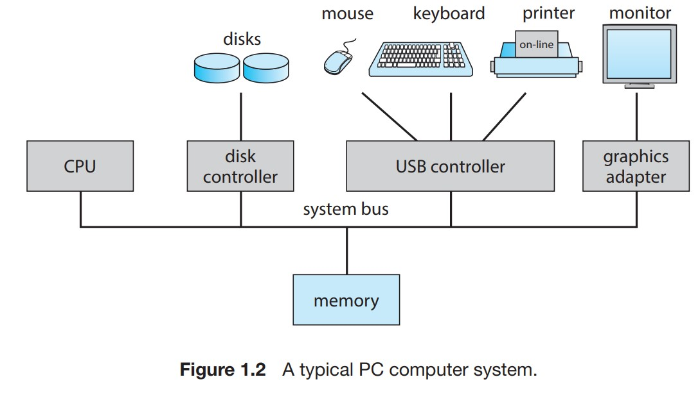
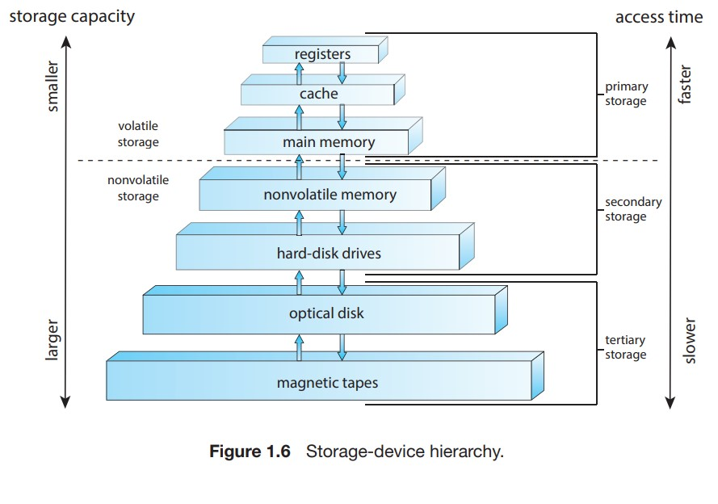
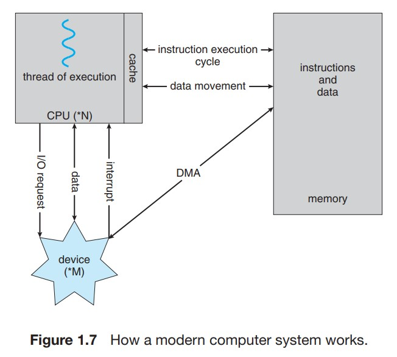
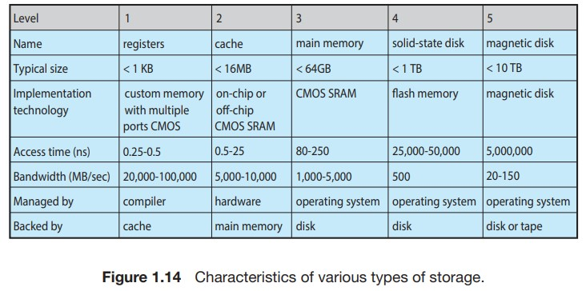
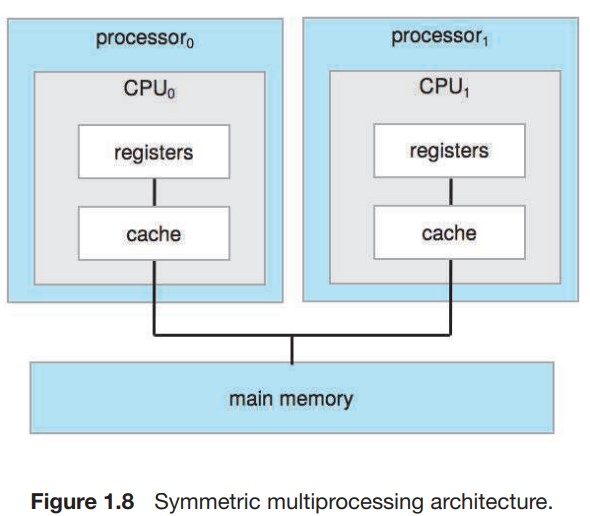
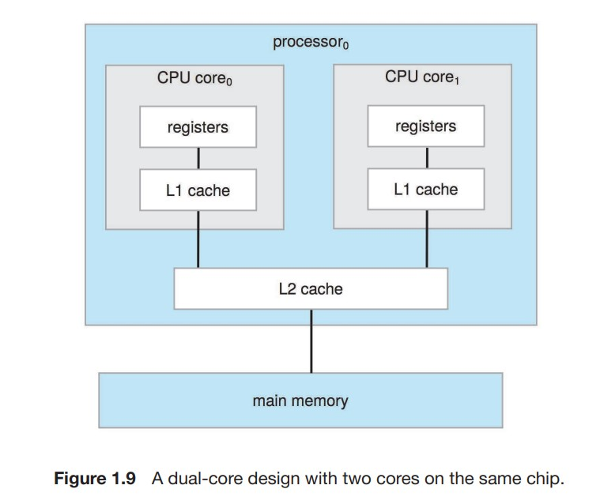

# Cap. 2

## Conceptos 2

* **Shells**: Interpretadores de comandos (CLI - Command-line interface).
* **Interfaz de syscall**: Intercepta los llamados de las API y hace los syscall necesarios para cubrilos.

## Preguntas 2

1. **¿Qué servicios ofrece un SO?**
   Interfaz de Usuario (GUI, touch-screen, CLI), manipulación del Sistema de Archivos, ejecución de programas, operaciones de I/O, detección de errores, registros(log), comunicación,  Asignación de recursos, protección y seguridad.(9)

2. **¿Qué tipos de llamados al sistema existen?**
   Existen 6 grandes grupos: Control de procesos, manejo de archivos, manejo de dispositivos, mantenimiento de info., comunicación y protección.

3. **¿Cómo es el ciclo de un llamado al sistema por parte de una aplicación de usuario?**
  Se produce el llamado tras el uso de una función de algún lenguaje (API), este llamado en modo usuario hace que la app guarde en un Stack on un arreglo en memoria los parámetros que se introdujeron en la API. Luego el Sistema pasa a modo Kernel para hacer el verdadero Syscall el cual se elige en el vector syscall, el SO toma la dirección de los params. del registro donde la app de usuario lo puso, y con esto el syscall obtiene sus datos haciendo POP en el stack en mem. Este proceso se hizo con una Interrupción la cual termina al retornar del syscall.
1. **¿Qué tipo de servicios o utilidades ofrecen los SO?**
   * Manejo de archivos: Crear, borrar, copiar, renombrar, listar y en general manipular archivos y directorios.
   * Modificación de archivos: Crear y modificar archivos que están en almacenamiento.
   * Estado e información: Dar la hora, espacio libre en el disco, cantidad de mem., cantidad de usuarios, información de registro(logging) y depuración(debugging).
   * Soporte de lenguajes de progra.: Compiladores, linkers, ensambladores, depuradores, interpretadores.
   * Carga y ejecución de programas: Un programa se ensambla, se compila y se carga en memoria para poder ejecutarlo. Puede proveer loaders absolutos, reubicables. Editores de enlace.
   * Comunicación: Proveen mecanismos que permiten coexiones virtuales entre procesos, usuarios y sistemas de compus.
   * Servicios de fondo (background): Procesos de uso general que se inician en tiempo de arranque. ``daemons, servicios o subsistemas``. Además de programas de aplicación de uso común.

## Recursos 2

# Cap. 5

## Conceptos 5

* **Calendarización expropiativa y no expropiativa**:
La programación expropiativa consiste en asignar recursos como ciclos de CPU a un proceso durante un tiempo limitado.
Ventajas de la programación expropiativa:

* Garantiza que ningún proceso monopolice el procesador, lo que aumenta la fiabilidad.
* Mejora los tiempos medios de respuesta y facilita una distribución equitativa del tiempo de CPU.
Desventajas de la programación expropiativa:

* Requiere importantes recursos informáticos para el cambio de contexto.
* Puede hacer que los procesos de baja prioridad esperen si los de alta prioridad llegan con frecuencia.

Programación no expropiativa:

Implica la retención de recursos de CPU por parte de un proceso hasta su finalización o el paso a un estado de espera.
Ventajas de la programación no expropiativa:

* Carga de programación mínima y procedimiento sencillo con alta tasa de rendimiento.
* Requiere menos recursos computacionales en comparación con la programación preferente.
Desventajas de la programación no expropiativa:
* Los procesos pueden experimentar tiempos de respuesta elevados con posibilidad de "morir de hambre"(starvation) del sistema debido a fallos.
Los procesos con tiempos de ráfaga cortos podrían morir de hambre si no se permite el derecho preferente.
Principales diferencias entre la planificación preferente y no preferente:

Incluye distinciones en la asignación de CPU, interrupción de procesos, sobrecarga de programación y flexibilidad.
La programación preferente permite una mejor utilización de la CPU, pero implica una mayor sobrecarga de programación.

* **Dispatcher**: El despachador en la programación de la CPU cambia el control entre procesos, cambia al modo de usuario y reanuda los programas. Su objetivo es ser rápido para minimizar la latencia de envío durante los cambios de contexto.
* **Ciclo de ráfaga(burst cycle) CPU/IO**:
Todos los procesos tienen ese ciclo en que alternan ráfagas de CPU con ráfagas de IO.
Un proceso ligado al CPU (CPU-bounded) suele tener pocas pero grande ráfagas de CPU. Uno ligado a E/S(I/O) más bien tiene muchas
pero cortas ráfagas de CPU.
  * ``CPU(compute) or IO-bounded process``: Se les llama así cuando el tiempo para completar un proceso está principalmente determinado por alguno de los dos.
* **Process Control Block (PCB)**:  Es una estructura de datos fundamental utilizada por el sistema operativo para representar y administrar los procesos que se ejecutan en el sistema. El PCB contiene información importante sobre cada proceso, como su identificador único, el estado actual de ejecución, los registros de la CPU, la información de programación (como prioridad y tiempo de ejecución restante), información de gestión de memoria y de recursos, y otros datos necesarios para administrar y realizar el cambio de contexto entre procesos.
* **Quantum (cuántico) o trozo de tiempo (time slice)**: Tiempo que se le brinda a cada proceso en el CPU. (Usualmente se implementa con 100ms)
* **Overhead**: Son los gastos en los que el SO incurre por hacer un cambio de contexto(Ver recursos).

## Preguntas 5

1. **¿Qué criterios de calendarización existen?**
   * Uso del CPU.
   * Rendimiento
   * Tiempo de espera.
   * Tiempo de respuesta.
   * Tiempo de vuelta(turnaround)
2. **¿Qué es y para qué sirve el Scheduling (Calendarización) en Sistemas Operativos?**  
Se usa para dar un orden en el que ejecutarse las diversas
tareas que tiene pendientes el Sistema Operativo con el uso eficiente del CPU. Si un CPU tiene solo un core, entonces podría correr solo
un proceso a la vez, lo que haría un uso ineficiente de ese CPU, aquí es donde entra, los algoritmos de calendarización, con los que se
logra un uso productivo del CPU evitando momentos en los que el CPU no tiene nada productivo que hacer, dando la capacidad de hacer varias
tareas de forma simultánea.
3. **¿Qué tipo de algoritmos de caledarización existen**

   * SJF-SRTF: Se basa en el burst time de cada proceso. SJF es no expropiativo mientras que JRTF es expropiativo, osea que si llega un proceso nuevo a la cola y resulta ser más pequeño que el que se estaba ejecutando, entonces lo expropian.
   * FCFS: Se basa en el tiempo de llegada. Puede haber un efecto convoy al tener a procesos esperando mucho tiempo por un proceso que utilice mucho tiempo el CPU, al no ser expropiativo. No se puede implementar a nivel de calendarización de CPU pues no se puede saber el burst time del siguiente proceso, una forma de hacerlo el estimarlo
   * RR(Round Robin): Usa el quantum para marcar el tiempo máximo que puede estar un proceso. Tiene una política parecida a FCFS.
   * Por prioridad: Se basa en el nivel de prioridad. También tiene una política FCFS si hay empate de prioridad. Depende del Sistema si un número bajo indica mayor o menor prioridad que un número más alto ``En el libro se utilizan números bajos para dar mayor prioridad. Osea 1 > 19 en cuanto a nivel de prioridad``. Una versión expropiativa de este algoritmo puede llegar a expropiar a un proceso si llega uno nuevo a la cola el cual tiene mayor prioridad. Sus principal problema es que puede ocasionar ``starvation`` en procesos de prioridad baja, ```¿Cómo se soluciona el starvation aquí?: Avejentando(aging) al proceso. Se le sube la prioridad a los procesos que llevan mucho tiempo en espera. Otra opción es combinarlo con RR``
   * Cola Multinivel: Hacer una cola por cada nivel de prioridad, ese nivel también puede basarse en el tipo de proceso que se quiere ejecutar.
   * Cola de retroalimentación multinivel: Se baja el nivel de prioridad de un proceso si se tarda más de lo establecido por su nivel de cola, se sube si lleva mucho tiempo (aging). El tiempo de cada nivel de colas es la mitad del anterior hasta que el último nivel tiene FCFS (usualmente).

## Recursos 5

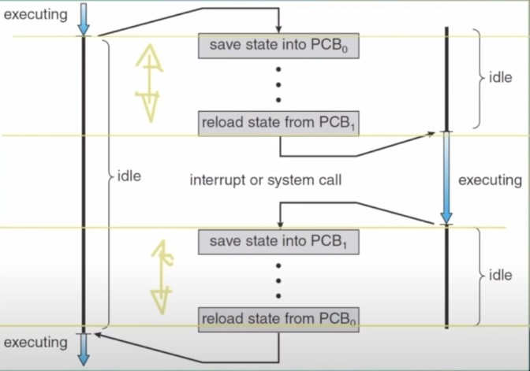

# Cap. 13

## Conceptos 13

* **Archivo**: Unidad de Almacenamiento lógico.
* **Enlace duro** (hard-link): Cuando un archivo tiene varios nombres(entradas a al directorio).
* **Tabla de archivos abiertos**: Se puede tener info de un archivo abierto indexado aquí. Para evitar hacer búsquedas por el archivo constantemente.
* Delete y Create funcionan con el archivo cerrado.
* Open permite modos, tales que solo-lectura, solo-escritura, etc.
* **Tabla por proceso y tabla de todo el sistema**: La 1era sigue la pista de cada archivo que abre un proceso, conteniendo el uso que le da tal proceso a tal archivo. Cada entrada de la 1era apunta a la 2da tabla. La tabla de todo el sistema contiene información independiente del proceso, como la ubicación del archivo en el disco, las fechas de acceso y el tamaño del archivo. Cuando un proceso 'x' abre un archivo que nadie ha abierto, este archivo tiene su entrada a la tabla 2 y 1, cuando un proceso 'y' abre ese mismo archivo lo único que se hace es una entrada a la tabla 1 la cual apunta a la entrada ya existente del archivo en tabla 2. Esto se controla con un open_Count en la entrada a la tabla 2.
* **Shared y Exclusive lock**: Shared == todos pueden leer, Exclusive = Solo uno puede escribir a la vez y cuando ese proceso escribe los demás no pueden leer.
* **Número mágico**: Algunos Sistemas UNIX ponen un número al inicio de archivos binarios, el cual indica el tipo de archivo que es.
* Cuando trabajamos con archivos, los "registros lógicos" contienen la información visible para usuarios y programas. El sistema operativo almacena datos en "bloques físicos", que pueden no coincidir en tamaño con los registros. Para optimizar el espacio, varios registros lógicos se pueden agrupar en un bloque físico, permitiendo una gestión más eficiente de la información
* **Bloque físico y (record) lógico**:  Un *bloque físico* es la unidad más pequeña de almacenamiento que puede ser leída o escrita en un disco por una sola operación de hardware (Usualmente 512 bytes). Un *bloque lógico*, también conocido como bloque de archivo o unidad de asignación, es la abstracción utilizada por los sistemas de archivos para gestionar y organizar los archivos en el almacenamiento.
* **Empaquetamiento(packing)**: El número de unidades lógicas que caben en un bloque físico determina su empaquetamiento y tiene un impacto en la cantidad de ``fragmentación interna`` (espacio desperdiciado) que se produce.
* **Directorio**: El directorio puede verse como una tabla de símbolos que traduce los nombres de los archivos a sus bloques de control.
* **MFD**: Se utiliza para realizar un seguimiento del directorio de cada usuario, y debe actualizarse cuando se añaden o eliminan usuarios del sistema. Directorio de directorios.
* **Ruta absoluta y relativa**: Abs.-Relacionada con el directorio raíz (C: Program Files/.../...). Relativa - Relacionada con el directorio actual(home/user1/...)
* **Volumen o unidad lógica**:  Es una única área de almacenamiento accesible con un único sistema de archivos
* ``UNIX proporciona dos tipos de enlaces para implementar la estructura de grafo acíclico.`` ( Ver "man ln" para más detalles.)
  * Un **enlace duro** ( normalmente llamado simplemente enlace ) implica múltiples entradas de directorio que se refieren ambas al mismo fichero. Los enlaces duros sólo son válidos para ficheros ordinarios en el mismo sistema de ficheros.
  * Un **enlace simbólico**, implica un archivo especial, que contiene información sobre dónde encontrar el archivo enlazado. Los enlaces simbólicos pueden utilizarse para enlazar directorios y/o ficheros en otros sistemas de ficheros, así como ficheros ordinarios en el sistema de ficheros actual.
* ``Windows sólo admite enlaces simbólicos, denominados accesos directos.``

## Preguntas 13

1. **¿Qué atributos tiene un archivo?**  Nombre, localización(en mem.), tipo, identificador(etiqueta para que la máquina lea, no legible humanamente), tamaño, protección(quién lo puede editar, leer, etc.) y marcas de tiempo. Archivos con atributos extendidos pueden agregar cosas como el tipo de codificado o aspectos de seguridad sobre el archivo, etc.
2. **¿Qué funciones tiene un Sistema de Archivos?**
   Crear, escribir, leer, borrar, reposicionarse(mover el puntero de la posición actual del archivo a una pos. específica - seek), truncar(cambiar contenido de un archivo sin cambiar sus atributos [además de el tamaño]). Esas son las básicas, también podríamos querer otras que muestren atributos(get), que cambien atributos a un valor específico (set), append, copiar.
3. **¿Qué información es asociada con una entrada en la Tabla de archivos de todo el Sistema(Sys.-wide)?**
   file_ptr(único de cada proceso), file_open_count, file_location y  access_rights.
4. **¿Qué desventaja tiene que un SO añada estructura a archivos?** Aumenta el tamaño y complejidad del SO, haciendolo más engorroso.
5. **¿Cuál es la forma en que se accesa internamente a los datos de un disco?** Por bloques físicos.
6. **¿Qué métodos de acceso existen?**
   1. Secuencial: El archivo es procesado en orden ``Es el más común de todos``. Record por record.
   * read_next: lee la siguiente porción del archivo y automáticamente avanza un puntero de archivo, que rastrea la ubicación de E/S.
   * write_next: añade al final del archivo y avanza hasta el final del material recién escrito (el nuevo final del archivo).
   * Puede adelantar o atrasarse en 'n' records.
   2. Directo o relativo: Se elige mediante un param. a qué record se va a accesar.
   * Útiles para accesar a grandes cantidades de info.
   * Número relativo de bloque es el índice relativo al inicio del archivo.
   * Funciones: read(n), write(n)
   * Demás métodos se pueden construir en base a este, como el . El índice, como un índice en la contraportada de un libro, contiene punteros a los distintos bloques. Para encontrar un registro en el fichero, primero buscamos en el índice y luego utilizamos el puntero para acceder directamente al fichero y encontrar el registro deseado.
7. **¿Qué operaciones se implementan en un directorio?**  createFile, searchFile, renameFile, deleteFile, listDir, traverseDir - Recorrer todos los directorios y todos sus archivos( En aras de la fiabilidad, conviene guardar el contenido y la estructura de todo el sistema de archivos a intervalos regulares).
8. **¿Qué esquemas de directorio existen?**
   1. Nivel único: Todos los archivos en un solo directorio, requiere de maniobrar con los nombres en caso de haber más de un usuario de un solo dispositivo.
   2. Nivel doble y estructurados como árbol: Directorios separados para cada usuario. Cada user tiene su UFD(User File Dir.), cada que un usuario inicia se busca su M(aster)FD. Usualmente se necesita otro directorio para ejecutables solo(Una **ruta de búsqueda(search path)** es la lista de directorios en los que buscar programas ejecutables, y puede establecerse de forma única para cada usuario.).
   * Search path: Buscar entre varios directorios hasta encontrar el archivo que se busca al no encontrarlo en el UFD del usuario que lo busca.
   * Name path (C: userb/test.txt-abs, home/user - relativo).
   * Se guardan igual que cualquier archivo, pero tienen su propia estructura definida por el SO, además de un bit que los identifica como directorio. Un bit en cada entrada de directorio define la entrada como archivo (0) o como subdirectorio (1).
   * ``El más común``
   3. Acíclico: No permite ciclos pero sí permite compartir archivos entre usuarios y directorios, cosa que no permite el de árbol.
   * Se estructura en enlaces duros y simbólicos (Win solo duros(shortcuts)).
   * Los enlaces duros requieren de un contador de enlaces.
   4. Grafo general: Permite ciclos, por ende necesita de un ``Recolector de basura``

## Recursos 13

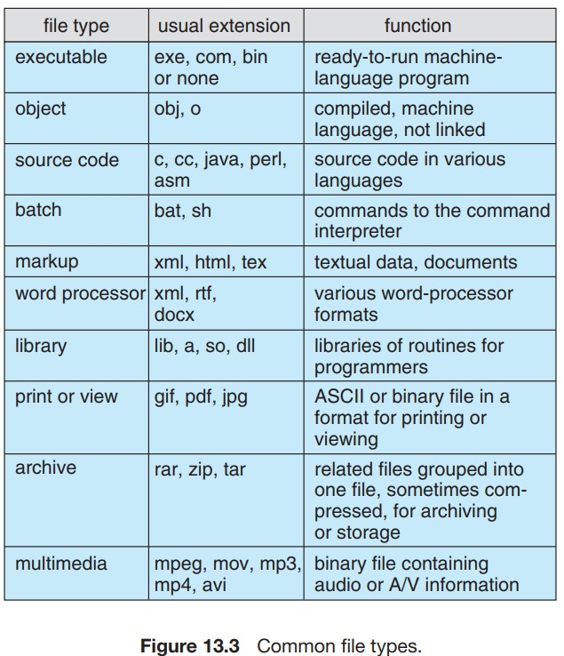
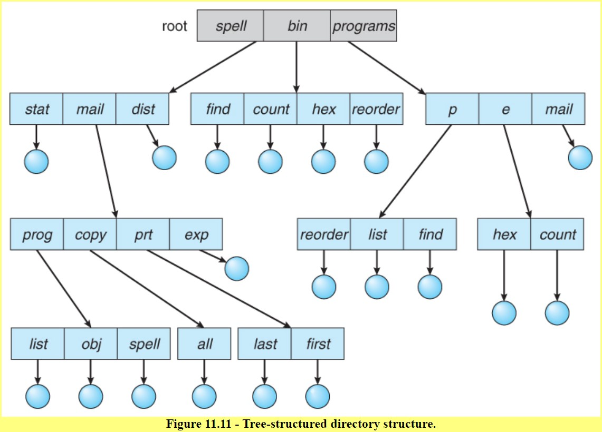

# Cap. 14

## Conceptos 14

* Los dispositivos **NVM** suelen estar divididos en bloques de 4096 bytes, sus métodos de transferencia son similares a los de las unidades de disco.
* **Open en el FS**: Retorna un puntero al Process open files table.
* **Fragmentación externa e interna**: Ocurre cuando hay suficiente espacio libre en el disco duro para almacenar un archivo, pero este espacio está dividido en varios bloques dispersos por el disco. Como resultado, aunque la cantidad total de espacio libre sea suficiente para el archivo, no existe un bloque contiguo lo suficientemente grande como para alojarlo. La interna: se produce cuando el espacio asignado a un archivo es mayor que el tamaño real del archivo.

## Preguntas 14

1. **¿Cuáles son los dos problemas principales de un Sistema de archivos?**  qué tanto del Sistema debe poder ver el usuario y  qué estructuras de datos y algoritmos utilizar para mapear al Sistema de archivos lógico en los dispositivos de almacenamiento secundario(NVM).
2. **Describa las capas del Sistema de Archivos**
   * El *Control de I/O* consiste en controladores de dispositivos, programas de software especiales ( a menudo escritos en ensamblador ) que se comunican con los dispositivos leyendo y escribiendo códigos especiales directamente hacia y desde las direcciones de memoria correspondientes a los registros de la tarjeta controladora. Cada tarjeta controladora ( dispositivo ) de un sistema tiene un conjunto diferente de direcciones ( registros, también conocidos como puertos ) que escucha, y un conjunto único de códigos de comando y códigos de resultados que entiende.
   * El *nivel básico del sistema de archivos* trabaja directamente con los controladores de dispositivos en términos de recuperación y almacenamiento de bloques de datos en bruto, sin ninguna consideración por lo que hay en cada bloque. Dependiendo del sistema, se puede hacer referencia a los bloques con un único número de bloque, ( por ejemplo, bloque # 234234 ), o con combinaciones de cabeza-sector-cilindro.
   * El *módulo de organización de archivos* conoce los archivos y sus bloques lógicos, y cómo se asignan a los bloques físicos del disco. Además de traducir de bloques lógicos a físicos, el módulo de organización de archivos también mantiene la lista de bloques libres, y asigna bloques libres a los archivos según sea necesario.
   * El *sistema lógico de ficheros* se ocupa de todos los metadatos asociados a un fichero ( UID, GID, modo, fechas, etc ), es decir, todo lo relacionado con el fichero excepto los datos en sí. Este nivel gestiona la estructura de directorios y la asignación de nombres de archivos a bloques de control de archivos (FCB), que contienen todos los metadatos, así como información sobre el número de bloque para encontrar los datos en el disco.
3. **¿Qué estructuras tiene el FS en el disco?**
   * **En almacenamiento** :
   * Bloque de control de arranque: Contiene en las primeras pos. del volumen la información necesaria para arrancar el SO. Si no lo contiene entonces está vacío.
   * Bloque de Control de Volumen: contiene detalles del volumen, como el número de bloques en el volumen, el tamaño de los bloques, un recuento de bloques libres y punteros a bloques libres, y un recuento de FCB(File Control Block) libres y punteros a FCB. En UFS, se denomina ``superbloque``. ``En NTFS, se almacena en la tabla maestra de archivos``.
   * Estructura de Directorios: Se utiliza para organizar los archivos.  Un FCB por archivo contiene muchos detalles sobre el archivo. Tiene un número identificador único para permitir la asociación con una entrada de directorio. En NTFS, esta información se almacena en la tabla maestra de archivos, que utiliza una estructura de base de datos relacional, con una fila por archivo.
   * También hay varias estructuras de datos clave almacenadas en **memoria**:
     * Una *tabla de montaje en memoria* contiene info. de cada volumen montado en mem.
     * Una *caché de directorios en memoria* con la información de los directorios a los que se ha accedido recientemente.
     * Una *tabla de archivos abiertos de todo el SO* de todo el sistema, que contiene una copia del FCB para cada archivo abierto actualmente en el sistema, así como otra información relacionada.
     * Una *tabla de archivos abiertos por proceso*, que contiene un puntero a la tabla de archivos abiertos del sistema, así como otra información. (Por ejemplo, el puntero a la posición actual del archivo puede estar aquí o en la tabla de archivos del sistema, dependiendo de la implementación y de si el archivo se comparte o no). )
4. **Explique el cierre de un archivo en FS** Se llama a close(file) para un proceso, se remueve ese file de la lista de abiertos en la tabla del proceso, mantieniendo el puntero a la tabla de abiertos del sistema. En la tabla general se decrementa el contador de procesos que lo tienen abierto, si este contador queda en cero: Se remueve del la tabla general tras copiarse de vuelta el FCB al directorio. Si es mayor a cero no pasa nada más.
5. **¿Cómo se puede implementar un directorio?**
   * Lista lineal: Se puede hacer con un arreglo o con un lista enlazada. El problema es que puede ser lento a la hora de buscar archivos, se pueden hacer mejoras como por ejemplo usar búsqueda binaria sobre un arreglo ordenado. Las supresiones pueden hacerse moviendo todas las entradas, marcando una entrada como suprimida o moviendo la última entrada a la nueva posición vacante.
   * Tabla Hash: A hash table can also be used to speed up searches. Hash tables are generally implemented in addition to a linear or other structure. Problema: Tamaño fijo.

# Recursos 14

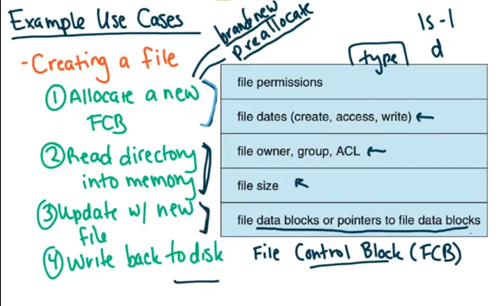
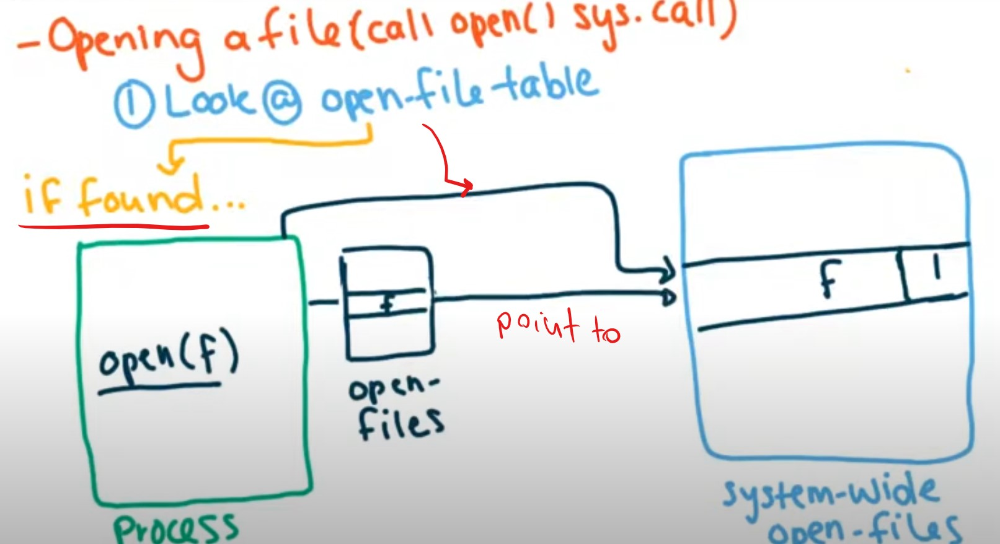
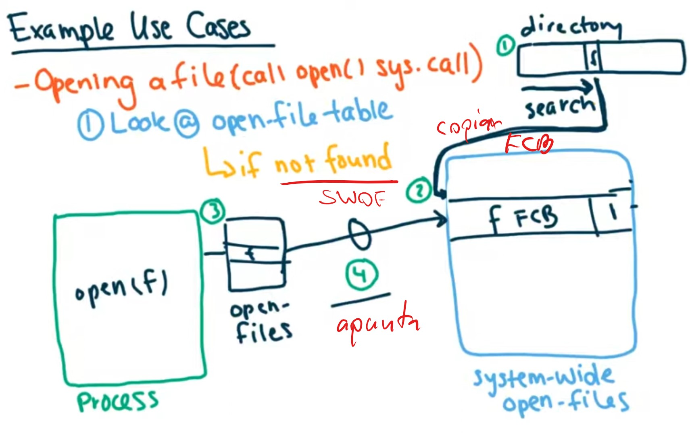
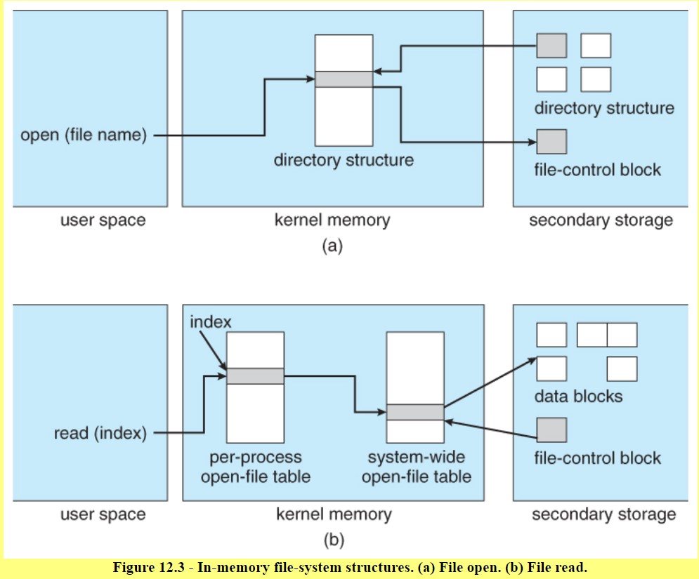
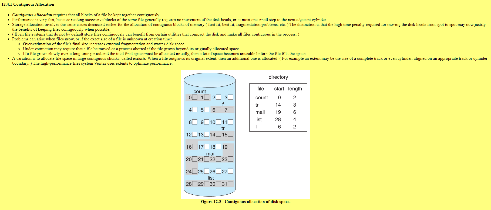
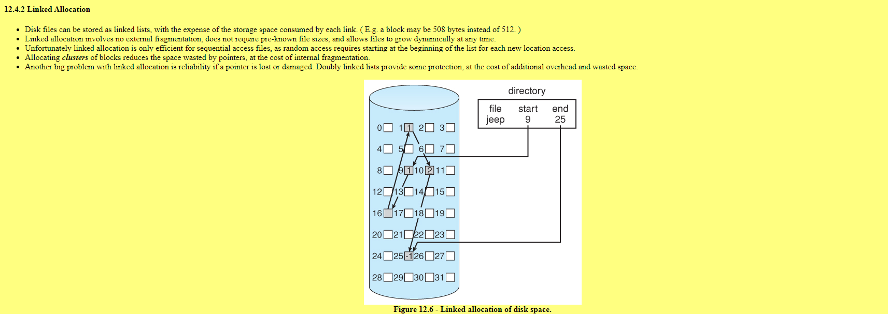
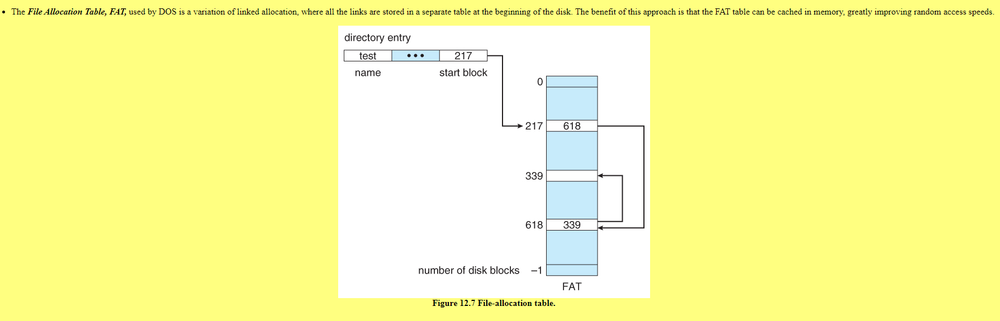
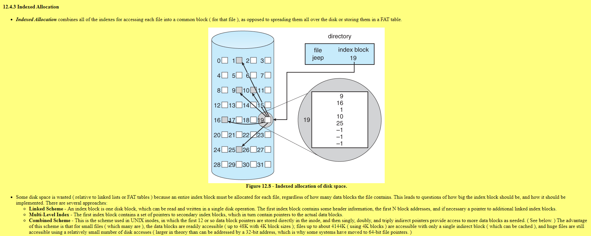
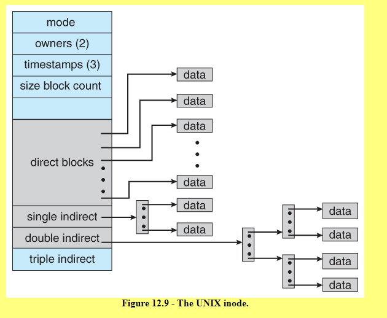
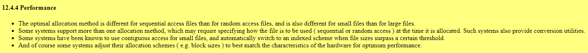
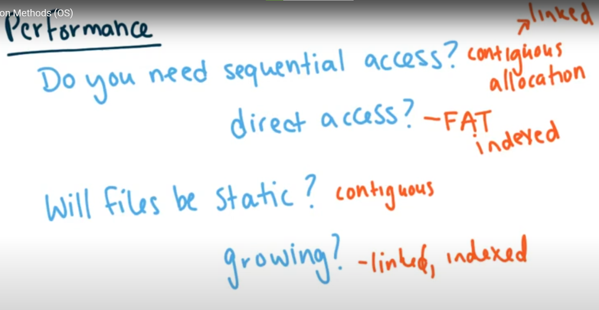

# Videos de encriptación
