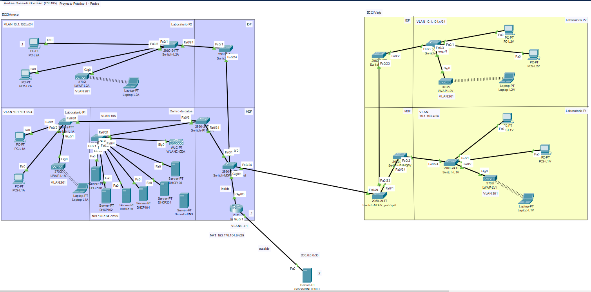
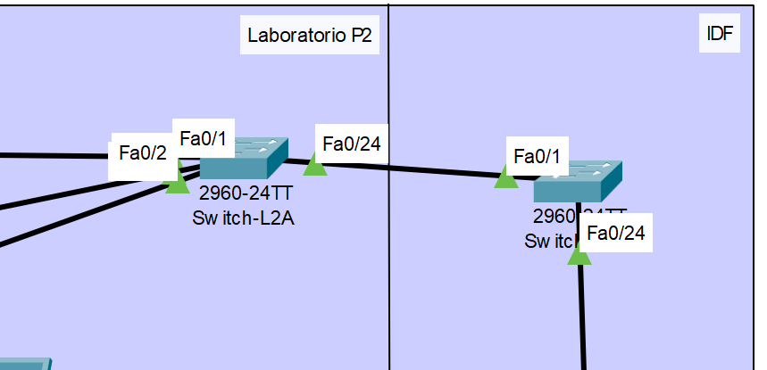
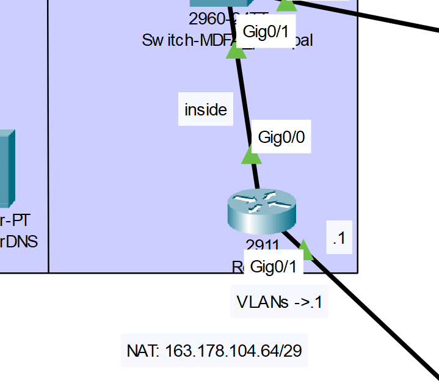
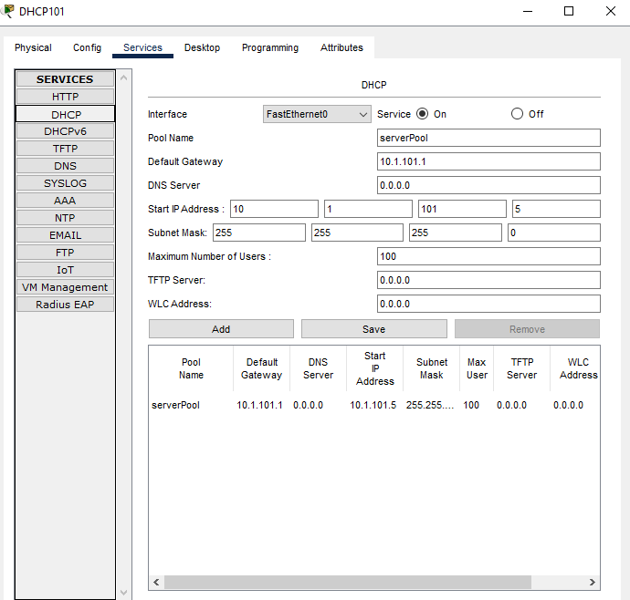

Universidad de Costa Rica  
CI-0121 Redes de comunicación de datos  
Grupo 3  
Docente: Mag. José Antonio Brenes Carranza  
Andrés Quesada González C16105  

# Proyecto Práctico - Etapa 1

## Descripción de la Red
Se quiere conectar a los dos edificios de la Escuela de Ciencias de la Computación e Informática (ECCI): Edificio Anexo y el Edificio "Viejo". Cada uno de estos edificios cuenta con dos plantas, en cada planta hay un laboratorio de informática, en el primer piso de cada edificio hay un MDF y en el segundo piso de cada uno hay un IDF. En el primer piso del Anexo está el Centro de Datos donde se encuentran todos los servicios de red (DNS, DHCP, NAT, Firewall, etc.).

Se requiere que los dispositivos de cada "cuarto" de los edificios esté conectado entre sí pero no con los de los otros "cuartos". Para esto se crean las siguientes VLAN(las cuales no deben comunicarse entre sí):
* **101**: *10.1.101.0/24* - laboratorio del piso 1, Edificio Anexo.
* **102**: *10.1.102.0/24* - laboratorio del piso 2, Edificio Anexo.
* **103**: *10.1.103.0/24* - laboratorio del piso 1, Edificio "Viejo".
* **104**: *10.1.104.0/24* - laboratorio del piso 2, Edificio "Viejo".
* **105**: *10.1.105.0/24* - Centro de Datos que está en el edificio Anexo.
* **201**: *10.1.201.0/24* - Dispositivos inalámbricos.

Además se tiene la VLAN 999 - VLAN nativa (tráfico no etiquetado).

Los equipos de la red reciben direccionamiento de un servidor DHCP que se encuentra en el Centro de Datos, en este caso hay un servidor DHCP por cada VLAN el cual brinda direcciones a partir de 10.1.VLAN.**5** en adelante, pues se reservan **.1** para el router y **.2** para el servidor DHCP mismo.

Los dispositivos inalámbricos son controlados por un único WLC el cual se encuentra en el Centro de Datos. El WLC tiene la red AURI, esta es utilizada por los dispositivos conectados a los LAP de cada laboratorio. La red inalámbrica viaja por la red usando la VLAN 201.Todas las direcciones IP privadas se
entregan de forma dinámica usando el DHCP que está en el Centro de Datos.

Por último las conexiones salientes de cada VLAN puede llegar a un Servidor HTTP el cual representaría una conexión a internet, estas se realizan mediante NAT utilizando un pool de 6 direcciones públicas del segmento 163.178.104.64/29.

### Componentes de la Red

* **Switches**: En cada "cuarto" que tenga dispositivos hay un switch al que se conectan vía acceso todos esos dispositivos. Cada piso tiene un switch al que se conectan troncalmente todos los switches de los "cuartos" con dispositivos, estos switches de cada piso se conectan trocalmente a su vez a otro switch que conecta a las dos plantas, por último este switch se conecta a un switch central que se encuentra en el MDF del Anexo el cual conecta troncalmente a los dos edificios.
* **Router**: Este router se encuentra con la forma de un router-on-a-stick, pues se conecta directamente al switch central (descrito anteriormente) para poder recibir y enrutar el tráfico de los dispositivos de las diferentes VLAN. También realiza un traducción mediante NAT(descrito anteriormente) para poder dar salida al servidor de "internet"(servicio HTTP). Aquí también se configura la prohibición de comunicación entre VLANs distintas.
* **Servidores DHCP**: Brindan direccionamiento a los dispositivos de las diferentes VLAN.
* **Servidor de internet(HTTP)**: Salida a una página para comprobar que un tráfico de una VLAN llega al router.
* **WLC**: Controlador de los dispositivos inalámbricos LAP. Provee "AURI".
* **LAPs**: Proporcionan conectividad inalámbrica a las VLAN configuradas, específicamente VLAN 201, gestionando la conexión de en este caso laptops que se encuentran en los laboratorios.
* **2 PCs y 1 laptop por laboratorio**: Dispositivos finales.

### La Red descrita se ve en la siguiente imágen.


## Descripción de las principales instrucciones 

  
En el switch de un laboratorio se usa ```switchport access vlan <numero_de_vlan>``` para la conexión de entrada de los dispositivos al switch. Mientras que para la salida al siguiente switch, en este caso el del IDF(que conectaría a los "cuartos" de ese piso) se hace con una conexión troncal usando estos comandos: 
```
  switchport mode trunk
  switchport trunk allowed vlan <número_de_vlan_permitida1>, <número_de_vlan_permitida2>
  switchport trunk native vlan 999
```
Donde **allowed** quiere decir que tráfico de esa VLAN se permite por esa interfaz, **native** VLAN para tráfico no etiquetado. Estas configuraciones se hacen dentro de la configuración de cada interfaz: 
```
configure terminal
interface <nombre_de_la_interfaz(Gig0/0, FastEthernet0/1, etc.)>
```
Y en el caso de los demás switches fuera de laboratorios o el Centro de datos, se hace todo con modo troncal de la misma forma que se explicó anteriormente, ya que se requiere de una sola conexión que lleve tráfico de diferentes VLAN y eso se hace con modo troncal.


Como se ve en la imágen el router recibe conexiones de troncales que lo conectan con todas las VLAN. Por ende hay que configurar a la interfaz Gig0/0 de forma específica, esto mediante subinterfaces: Gig0/0.101, Gig0/0.102, Gig0/0.103, Gig0/0.104, Gig0/0.105 y Gig0/0.201. Aquí se configura la IP de esa subinterfaz, la encapsulación y se indica que es la parte interna(inside) para las traducciones que permiten la salida a internet:
```
interface GigabitEthernet0/0.<número_de_vlan>
 encapsulation dot1Q <número_de_vlan>
 ip address 10.1.<número_de_vlan>.1 255.255.255.0
 ip nat inside
```
Para evitar que las VLAN se comuniquen entre sí se hace lo siguiente:
``` 
access-list <número_de_vlan> deny ip 10.1.<número_de_vlan>.0 0.0.0.255 10.1.<número_de_vlan_a_restringir1>.0 0.0.0.255
access-list <número_de_vlan> deny ip 10.1.<número_de_vlan>.0 0.0.0.255 10.1.<número_de_vlan_a_restringir2>.0 0.0.0.255
access-list <número_de_vlan> deny ip 10.1.<número_de_vlan>.0 0.0.0.255 10.1.<número_de_vlan_a_restringir3>.0 0.0.0.255
access-list <número_de_vlan> deny ip 10.1.<número_de_vlan>.0 0.0.0.255 10.1.<número_de_vlan_a_restringir4>.0 0.0.0.255
access-list <número_de_vlan> deny ip 10.1.<número_de_vlan>.0 0.0.0.255 10.1.<número_de_vlan_a_restringir5>.0 0.0.0.255
access-list <número_de_vlan> permit ip any any
```
Con "deny" se evita que la primera VLAN haga conexión con la segunda VLAN que se menciona en el comando. Con "access-list <número_de_vlan> permit ip any any" se indica que permita toda otra comunicación. Para "confirmar" esta lista de acceso se va a la configuración de la subinterfaz y se pone: ``ip access-group <lista_de_acceso> in``.

Finalmente se hace la parte outside de la traducción NAT: 
```
interface GigabitEthernet0/1
 ip address 200.0.0.1 255.255.255.252
 ip nat outside
```
Marcando que las direcciones NAT salen hacia esa dirección. Pero ¿Cómo se configuran las NAT?: 
```
ip nat pool POOL_ECCI 163.178.104.65 163.178.104.70 netmask 255.255.255.248
ip nat inside source list 1 pool POOL_ECCI
```
Se le "prestan" a las direcciones privadas (10.1.vlan.x/24) direcciones públicas en ese rango definido por "POOL_ECCI".


Así están configurados los servers DHCP de cada VLAN para dar direcciones desde 10.1.vlan.5 en adelante.

## Dump de intrucciones sobre switches y router

## Pruebas sobre la Red
