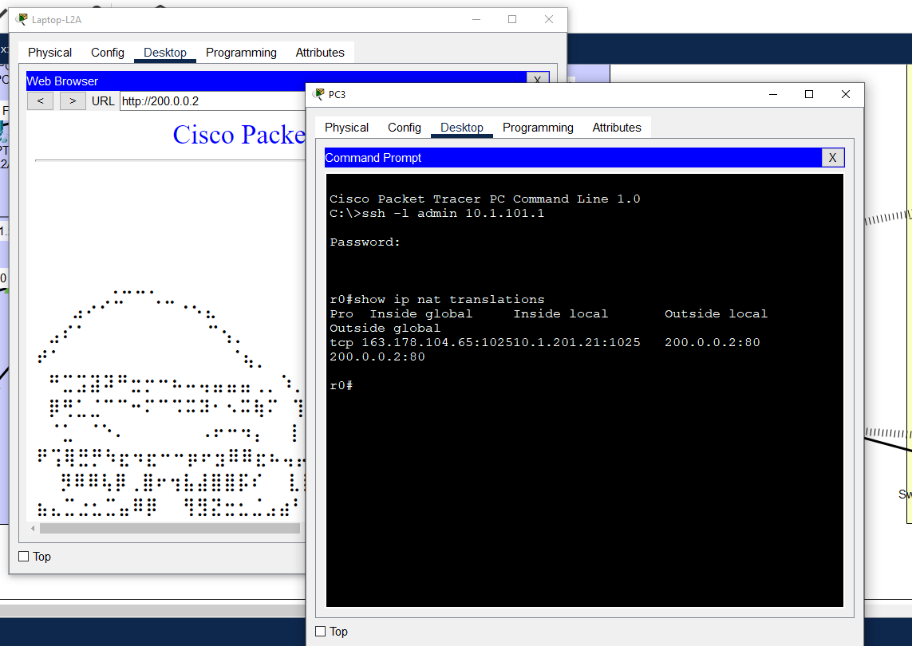
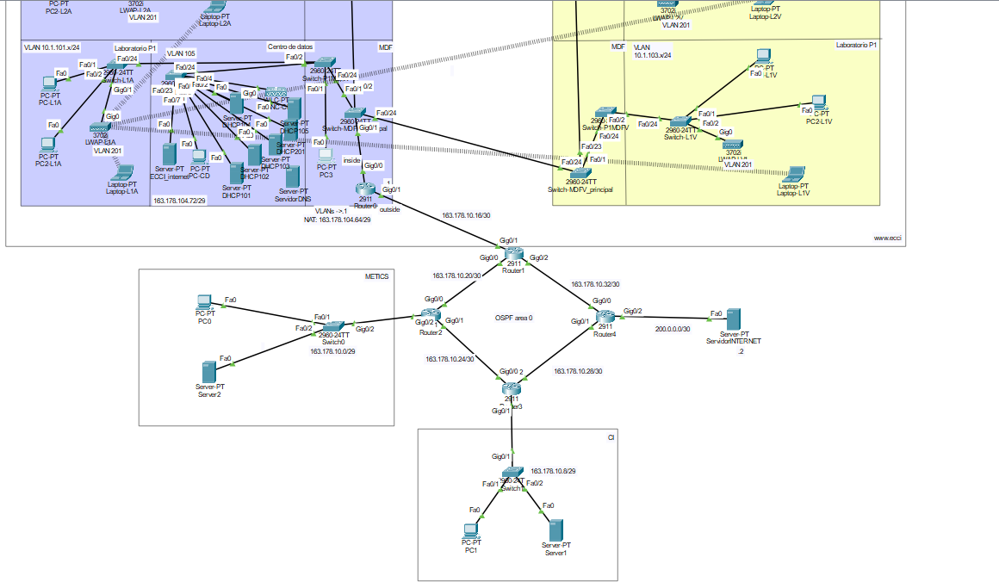

Universidad de Costa Rica  
CI-0121 Redes de comunicación de datos  
Grupo 3  
Docente: Mag. José Antonio Brenes Carranza  
Andrés Quesada González C16105  

# Proyecto Práctico - Etapa 2

## Correcciones de la anterior etapa.
### NAT funcionando:

## Descripción de la Red (solo los cambios respecto a la anterior)

Se tienen varias redes locales conectadas entre sí con el fin de simular la red de la UCR. En esta ocasión se toman las redes de METICS y el Centro de Informática de la UCR y se conectan mediante routers con IPs públicas entre sí y también a la ECCI que ya estaba trabajada en la Etapa 1. Se establece disponibilidad entre servidores que contienen la página web de la ECCI en el centro de datos del edificio Anexo, la página web de M.V. en METICS y la página del Centro de informática en el edificio respectivo.

En este caso a diferencia de la ECCI, METICS y C.I. están solo de manera representativa siendo redes pequeñas con un PC y un servidor HTTP únicamente. 
La forma de disponer de todos los servidores desde fuera de esas redes es mediante un anillo de Routers y el uso del protocolo OSPF con el que se logra encontrar el camino más corto para que un "mensaje" de una red llegue a otra por el camino más corto posible.

## Componentes agregados a la Red
* PCs: Un PC por cada red nueva excepto en la de internet (200.0.0.0/30), además de un PC para pruebas en el CD 105 y uno para controlar el router de la ECCI en el MDF que está en el Edificio Anexo.
* Routers: Cuatro routers POP (Point of Presence) para transmitir los datos necesarios entre redes distintas.
* Servidores: Contienen las páginas de MV, ECCI y CI.

### La Red descrita se ve en la siguiente imágen.

## Planificación de subnetting
### Red original
La red asignada para este ejercicio es 163.178.10.0/24, lo que significa que tenemos un rango de direcciones IP desde 163.178.10.0 hasta 163.178.10.255. Esta red /24 proporciona un total de 256 direcciones IP.
### Subredes
Decidí dividir la red original de la UCR en subredes /29 y /30. /29 para las direcciones públicas que prestan mediante NAT dinámico los routers de cada subred, esto puesto que al igual que en la etapa 1 los edificios solo van a tener unos cuantos dispositivos que no estarán solicitando la totalidad de IPs públicas de la subred al mismo tiempo, por lo que es suficiente con los 6 hosts válidos que ofrece /29, aún más considerando que la cantidad de dispositivos fuera de la ECCI es mucho menor. 
/30 lo elegí para la parte "externa" de los POP, ya que solo necesito dos direcciones IP, la del router que hace de Gateway para esa subred y la del otro router que se conecta con este que es Gateway de la subred específica.*

La división de subredes está definida de la siguiente manera:    
   
**/29**
* *Subred 1 (METICS Equipos)*: 163.178.10.0/29
Disponibles: 163.178.10.1 a 163.178.10.6
* *Subred 2 (CI Equipos)*: 163.178.10.8/29
Disponibles: 163.178.10.9 a 163.178.10.14  
   
**/30**   
* *Subred 3 (RouterECCI-Router1)*: 163.178.10.16/30
Disponibles: 163.178.10.17 y 163.178.10.18
* *Subred 4 (Router1-Router2)*: 163.178.10.20/30
Disponibles: 163.178.10.21 y 163.178.10.22
* *Subred 5 (Router2-Router3)*: 163.178.10.24/30
Disponibles: 163.178.10.25 y 163.178.10.26
* *Subred 6 (Router3-Router4)*: 163.178.10.28/30
Disponibles: 163.178.10.29 y 163.178.10.30
* *Subred 7 (Router4-Router1)*: 163.178.10.32/30
Disponibles: 163.178.10.33 y 163.178.10.34

## Descripción de las principales instrucciones

## Dump de intrucciones sobre switches y router
