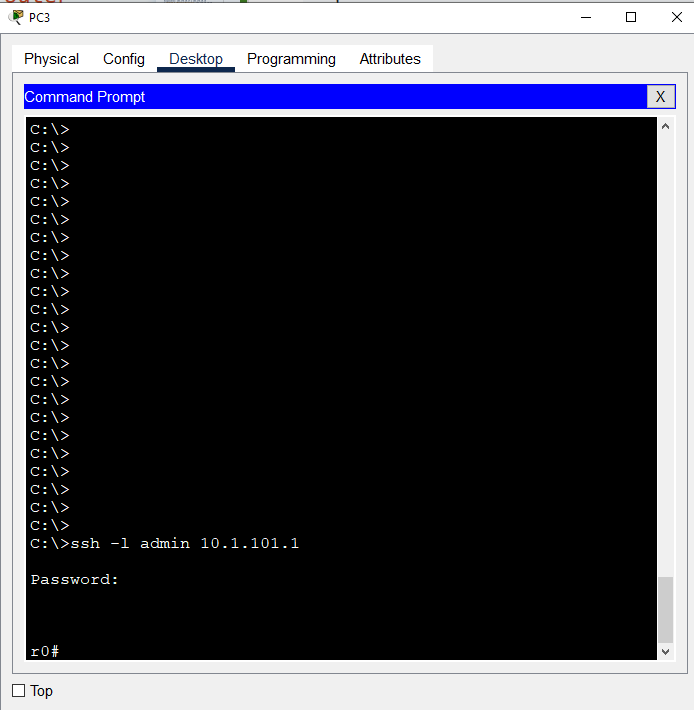
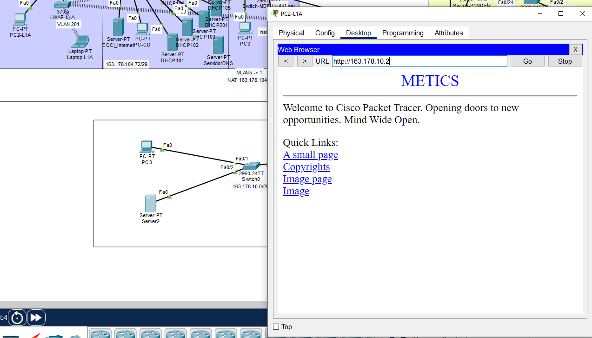
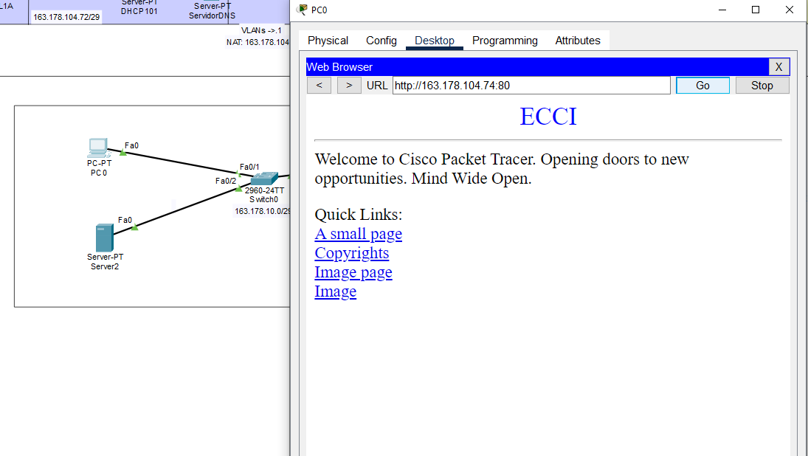
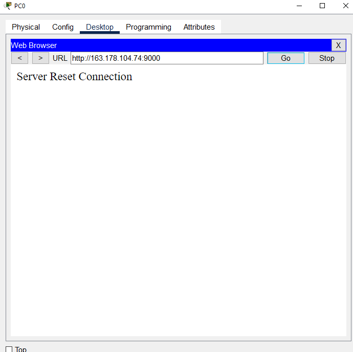
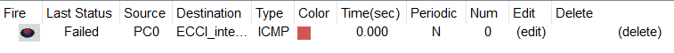

Universidad de Costa Rica  
CI-0121 Redes de comunicación de datos  
Grupo 3  
Docente: Mag. José Antonio Brenes Carranza  
Andrés Quesada González C16105  

# Proyecto Práctico - Etapa 2

## Correcciones de la anterior etapa.
### NAT funcionando:


## Descripción de la Red (solo los cambios respecto a la anterior)

Se tienen varias redes locales conectadas entre sí con el fin de simular la red de la UCR. En esta ocasión se toman las redes de METICS y el Centro de Informática de la UCR y se conectan mediante routers con IPs públicas entre sí y también a la ECCI que ya estaba trabajada en la Etapa 1. Se establece disponibilidad entre servidores que contienen la página web de la ECCI en el centro de datos del edificio Anexo, la página web de M.V. en METICS y la página del Centro de informática en el edificio respectivo.

En este caso a diferencia de la ECCI, METICS y C.I. están solo de manera representativa siendo redes pequeñas con un PC y un servidor HTTP únicamente. 
La forma de disponer de todos los servidores desde fuera de esas redes es mediante un anillo de Routers y el uso del protocolo OSPF con el que se logra encontrar el camino más corto para que un "mensaje" de una red llegue a otra por el camino más corto posible.

## Componentes agregados a la Red
* PCs: Un PC por cada red nueva excepto en la de internet (200.0.0.0/30), además de un PC para pruebas en el CD 105 y uno para controlar el router de la ECCI en el MDF que está en el Edificio Anexo.
* Routers: Cuatro routers POP (Point of Presence) para transmitir los datos necesarios entre redes distintas.
* Servidores: Contienen las páginas de MV, ECCI y CI.

### La Red descrita se ve en la siguiente imágen.


## Planificación de subnetting
### Red original
La red asignada para este ejercicio es 163.178.10.0/24, lo que significa que tenemos un rango de direcciones IP desde 163.178.10.0 hasta 163.178.10.255. Esta red /24 proporciona un total de 256 direcciones IP.
### Subredes
Decidí dividir la red original de la UCR en subredes /29 y /30. /29 para las direcciones públicas que prestan mediante NAT dinámico los routers de cada subred, esto puesto que al igual que en la etapa 1 los edificios solo van a tener unos cuantos dispositivos que no estarán solicitando la totalidad de IPs públicas de la subred al mismo tiempo, por lo que es suficiente con los 6 hosts válidos que ofrece /29, aún más considerando que la cantidad de dispositivos fuera de la ECCI es mucho menor. 
/30 lo elegí para la parte "externa" de los POP, ya que solo necesito dos direcciones IP, la del router que hace de Gateway para esa subred y la del otro router que se conecta con este que es Gateway de la subred específica.*

La división de subredes está definida de la siguiente manera:    
   
**/29**
* *Subred 1 (METICS Equipos)*: 163.178.10.0/29
Disponibles: 163.178.10.1 a 163.178.10.6
* *Subred 2 (CI Equipos)*: 163.178.10.8/29
Disponibles: 163.178.10.9 a 163.178.10.14  
   
**/30**   
* *Subred 3 (RouterECCI-Router1)*: 163.178.10.16/30
Disponibles: 163.178.10.17 y 163.178.10.18
* *Subred 4 (Router1-Router2)*: 163.178.10.20/30
Disponibles: 163.178.10.21 y 163.178.10.22
* *Subred 5 (Router2-Router3)*: 163.178.10.24/30
Disponibles: 163.178.10.25 y 163.178.10.26
* *Subred 6 (Router3-Router4)*: 163.178.10.28/30
Disponibles: 163.178.10.29 y 163.178.10.30
* *Subred 7 (Router4-Router1)*: 163.178.10.32/30
Disponibles: 163.178.10.33 y 163.178.10.34

## Descripción de las principales instrucciones

### OSPF
```
Router(config)#router ospf <id>
Router(config-router)#network <ip> <wildcard> area <area_index>
```
Estos comandos configuran el protocolo de enrutamiento **OSPF (Open Shortest Path First)** en un router.   
El primer comando activa OSPF en el router, donde ``<id>`` es un número que identifica el proceso OSPF en el router. Este identificador permite distinguir entre múltiples procesos OSPF que podrían estar corriendo en el mismo dispositivo.  
El segundo comando especifica qué redes serán anunciadas y participarán en el proceso OSPF. En este comando, ``<ip>`` es la dirección de red que se está configurando, ``<wildcard>`` es la máscara de comodines que define el rango de direcciones IP en esa red, y ``<area_index>`` es el número del área OSPF a la que pertenece la red.

```
ip route <ip_presentacion> <máscara> <ip_del_router_al_que_dirigir_el_tráfico>
redistribute static subnets
```
El comando ip route ``<ip_presentacion> <máscara> <ip_del_router_al_que_dirigir_el_tráfico>`` configura una ruta estática en el router. Aquí, ``<ip_presentacion>`` es la dirección de red de destino que se desea alcanzar, ``<máscara>`` es la máscara de subred asociada con esa red de destino, y ``<ip_del_router_al_que_dirigir_el_tráfico>`` es la dirección IP del router de siguiente salto al que se debe enviar el tráfico destinado a la red especificada. Este comando se utiliza para definir rutas específicas en las tablas de enrutamiento del router, asegurando que el tráfico se dirija correctamente a través de la red.

El comando ``redistribute static subnets`` se utiliza dentro de la configuración de un protocolo de enrutamiento dinámico (como OSPF o EIGRP) para redistribuir rutas estáticas en el dominio de enrutamiento dinámico. Esto permite que las rutas estáticas configuradas en el router se compartan con otros routers a través del protocolo de enrutamiento dinámico, haciendo que las subredes estáticas sean conocidas y utilizables por todo el dominio de enrutamiento.

### Firewall, SSH y ICMP
```
Router(config)# access-list 100 permit tcp any host <IP_del_servidor_web> eq 80
Router(config)# access-list 100 permit tcp host <IP_computadora_MDF> host <IP_del_servidor_web> eq 22
Router(config)# access-list 100 deny icmp any any
```
Se bloquean accesos a puertos que no sean el 80 para el servidor de la ECCI.   
El segundo comando solo le permite al PC del MDF tener tráfico SSH por medio de puerto 22.   
El último bloquea tráfico ICMP, como por ejemplo los paquetes ping.

#### SSH
```
Router(config)# access-list 100 permit tcp host <ip> any eq 22
Router(config)# line vty 0 4
Router(config-line)# access-class 100 in
Router(config-line)# exit
Router(config)# ip domain-name example.com
Router(config)# crypto key generate rsa
Router(config)# ip ssh version 2
Router(config)# username admin privilege 15 secret <contraseña>
Router(config)# line vty 0 4
Router(config-line)# login local
Router(config-line)# transport input ssh
```
Estos comandos configuran el acceso seguro mediante SSH en un router:

1. `Router(config)# access-list 100 permit tcp host <ip> any eq 22`: Este comando crea una lista de acceso (ACL) numerada (100) que permite el tráfico TCP desde una dirección IP específica (`<ip>`) hacia cualquier destino en el puerto 22 (usado para SSH).

2. `Router(config)# line vty 0 4`: Este comando selecciona las líneas de terminal virtual (VTY) de 0 a 4, que son las interfaces de línea de comando accesibles de forma remota.

3. `Router(config-line)# access-class 100 in`: Este comando aplica la lista de acceso 100 a las líneas VTY, restringiendo el acceso solo a las conexiones que cumplan con las condiciones especificadas en la ACL 100.

4. `Router(config-line)# exit`: Este comando sale del modo de configuración de línea.

5. `Router(config)# ip domain-name example.com`: Este comando configura el nombre de dominio del router como `example.com`.

6. `Router(config)# crypto key generate rsa`: Este comando genera una clave RSA para el uso de SSH. El router solicita el tamaño de la clave (generalmente 1024 o 2048 bits).

7. `Router(config)# ip ssh version 2`: Este comando habilita la versión 2 de SSH, que es más segura y recomendada sobre la versión 1.

8. `Router(config)# username admin privilege 15 secret <contraseña>`: Este comando crea un usuario llamado `admin` con privilegios de nivel 15 (máximo nivel de privilegio) y establece su contraseña (`<contraseña>`) de manera segura.

9. `Router(config)# line vty 0 4`: Este comando vuelve a seleccionar las líneas VTY de 0 a 4.

10. `Router(config-line)# login local`: Este comando configura el router para utilizar la base de datos local de usuarios para la autenticación en las líneas VTY.

11. `Router(config-line)# transport input ssh`: Este comando restringe el método de acceso a las líneas VTY únicamente a SSH, deshabilitando otros métodos como Telnet.

Estos comandos en conjunto configuran el router para permitir el acceso remoto seguro a través de SSH, utilizando una lista de acceso para restringir el origen de las conexiones y estableciendo un usuario con privilegios administrativos.

## Dump de intrucciones sobre switches y router

**Router0-MDF**
```
Current configuration : 4196 bytes
!
version 15.1
no service timestamps log datetime msec
no service timestamps debug datetime msec
no service password-encryption
!
hostname r0
!
!
!
enable secret 5 $1$mERr$9cTjUIEqNGurQiFU.ZeCi1
!
!
!
!
!
!
ip cef
no ipv6 cef
!
!
!
username admin privilege 15 secret 5 $1$mERr$0Iy.SNK5OwhAYY0dcQNkr0
!
!
license udi pid CISCO2911/K9 sn FTX1524SLSN-
!
!
!
!
!
!
!
!
!
ip ssh version 2
ip ssh authentication-retries 2
ip domain-name www.ecci
!
!
spanning-tree mode pvst
!
!
!
!
!
!
interface GigabitEthernet0/0
 no ip address
 ip nat outside
 duplex auto
 speed auto
!
interface GigabitEthernet0/0.1
 no ip address
 shutdown
!
interface GigabitEthernet0/0.101
 encapsulation dot1Q 101
 ip address 10.1.101.1 255.255.255.0
 ip access-group 101 in
 ip nat inside
!
interface GigabitEthernet0/0.102
 encapsulation dot1Q 102
 ip address 10.1.102.1 255.255.255.0
 ip access-group 102 in
 ip nat inside
!
interface GigabitEthernet0/0.103
 encapsulation dot1Q 103
 ip address 10.1.103.1 255.255.255.0
 ip access-group 103 in
 ip nat inside
!
interface GigabitEthernet0/0.104
 encapsulation dot1Q 104
 ip address 10.1.104.1 255.255.255.0
 ip access-group 104 in
 ip nat inside
!
interface GigabitEthernet0/0.105
 encapsulation dot1Q 105
 ip address 163.178.104.73 255.255.255.248
 ip access-group 100 in
 ip nat inside
!
interface GigabitEthernet0/0.201
 encapsulation dot1Q 201
 ip address 10.1.201.1 255.255.255.0
 ip access-group 110 in
 ip nat inside
!
interface GigabitEthernet0/0.999
 encapsulation dot1Q 999 native
 no ip address
!
interface GigabitEthernet0/1
 ip address 163.178.10.17 255.255.255.252
 ip nat outside
 duplex auto
 speed auto
!
interface GigabitEthernet0/2
 no ip address
 duplex auto
 speed auto
 shutdown
!
interface Vlan1
 no ip address
 shutdown
!
router ospf 1
 log-adjacency-changes
 network 163.178.10.16 0.0.0.3 area 0
!
router rip
!
ip nat pool POOL_ECCI 163.178.104.65 163.178.104.70 netmask 255.255.255.248
ip nat inside source list 1 pool POOL_ECCI
ip classless
!
ip flow-export version 9
!
!
access-list 101 deny ip 10.1.101.0 0.0.0.255 10.1.102.0 0.0.0.255
access-list 101 deny ip 10.1.101.0 0.0.0.255 10.1.103.0 0.0.0.255
access-list 101 deny ip 10.1.101.0 0.0.0.255 10.1.104.0 0.0.0.255
access-list 101 deny ip 10.1.101.0 0.0.0.255 10.1.105.0 0.0.0.255
access-list 101 deny ip 10.1.101.0 0.0.0.255 10.1.201.0 0.0.0.255
access-list 101 permit ip any any
access-list 102 deny ip 10.1.102.0 0.0.0.255 10.1.101.0 0.0.0.255
access-list 102 deny ip 10.1.102.0 0.0.0.255 10.1.103.0 0.0.0.255
access-list 102 deny ip 10.1.102.0 0.0.0.255 10.1.104.0 0.0.0.255
access-list 102 deny ip 10.1.102.0 0.0.0.255 10.1.105.0 0.0.0.255
access-list 102 deny ip 10.1.102.0 0.0.0.255 10.1.201.0 0.0.0.255
access-list 102 permit ip any any
access-list 103 deny ip 10.1.103.0 0.0.0.255 10.1.104.0 0.0.0.255
access-list 103 deny ip 10.1.103.0 0.0.0.255 10.1.105.0 0.0.0.255
access-list 103 deny ip 10.1.103.0 0.0.0.255 10.1.201.0 0.0.0.255
access-list 103 permit ip any any
access-list 103 deny ip 10.1.103.0 0.0.0.255 10.1.101.0 0.0.0.255
access-list 103 deny ip 10.1.103.0 0.0.0.255 10.1.102.0 0.0.0.255
access-list 104 deny ip 10.1.104.0 0.0.0.255 10.1.101.0 0.0.0.255
access-list 104 deny ip 10.1.104.0 0.0.0.255 10.1.102.0 0.0.0.255
access-list 104 deny ip 10.1.104.0 0.0.0.255 10.1.103.0 0.0.0.255
access-list 104 deny ip 10.1.104.0 0.0.0.255 10.1.105.0 0.0.0.255
access-list 104 deny ip 10.1.104.0 0.0.0.255 10.1.201.0 0.0.0.255
access-list 104 permit ip any any
access-list 110 deny ip 10.1.201.0 0.0.0.255 10.1.101.0 0.0.0.255
access-list 110 deny ip 10.1.201.0 0.0.0.255 10.1.102.0 0.0.0.255
access-list 110 deny ip 10.1.201.0 0.0.0.255 10.1.103.0 0.0.0.255
access-list 110 deny ip 10.1.201.0 0.0.0.255 10.1.104.0 0.0.0.255
access-list 110 deny ip 10.1.201.0 0.0.0.255 10.1.105.0 0.0.0.255
access-list 110 permit ip any any
access-list 1 permit 10.1.0.0 0.0.255.255
access-list 100 permit tcp host 10.1.101.200 any eq 22
access-list 100 permit tcp any host 163.178.104.74 eq www
access-list 100 deny icmp any any
access-list 100 permit ip any any
!
!
!
!
!
line con 0
!
line aux 0
!
line vty 0 4
 access-class 100 in
 exec-timeout 1 0
 login local
 transport input ssh
!
!
!
end
```

**r2**
```
Current configuration : 900 bytes
!
version 15.1
no service timestamps log datetime msec
no service timestamps debug datetime msec
no service password-encryption
!
hostname r2
!
!
!
!
!
!
!
!
ip cef
no ipv6 cef
!
!
!
!
license udi pid CISCO2911/K9 sn FTX1524L4A1-
!
!
!
!
!
!
!
!
!
!
!
spanning-tree mode pvst
!
!
!
!
!
!
interface GigabitEthernet0/0
 ip address 163.178.10.22 255.255.255.252
 duplex auto
 speed auto
!
interface GigabitEthernet0/1
 ip address 163.178.10.25 255.255.255.252
 duplex auto
 speed auto
!
interface GigabitEthernet0/2
 ip address 163.178.10.1 255.255.255.248
 duplex auto
 speed auto
!
interface Vlan1
 no ip address
 shutdown
!
router ospf 1
 log-adjacency-changes
 network 163.178.10.20 0.0.0.3 area 0
 network 163.178.10.24 0.0.0.3 area 0
 network 163.178.10.0 0.0.0.7 area 0
!
router rip
!
ip classless
!
ip flow-export version 9
!
!
!
!
!
!
!
line con 0
!
line aux 0
!
line vty 0 4
 login
!
!
!
end
```

**r1**
```

Current configuration : 1032 bytes
!
version 15.1
no service timestamps log datetime msec
no service timestamps debug datetime msec
no service password-encryption
!
hostname r1
!
!
!
!
!
!
!
!
no ip cef
no ipv6 cef
!
!
!
!
license udi pid CISCO2911/K9 sn FTX1524B968-
!
!
!
!
!
!
!
!
!
!
!
spanning-tree mode pvst
!
!
!
!
!
!
interface GigabitEthernet0/0
 ip address 163.178.10.21 255.255.255.252
 duplex auto
 speed auto
!
interface GigabitEthernet0/1
 ip address 163.178.10.18 255.255.255.252
 duplex auto
 speed auto
!
interface GigabitEthernet0/2
 ip address 163.178.10.34 255.255.255.252
 duplex auto
 speed auto
!
interface Vlan1
 no ip address
 shutdown
!
router ospf 1
 log-adjacency-changes
 redistribute static subnets 
 network 163.178.10.20 0.0.0.3 area 0
 network 163.178.10.16 0.0.0.3 area 0
 network 163.178.10.32 0.0.0.3 area 0
!
ip classless
ip route 163.178.104.64 255.255.255.248 163.178.10.17 
ip route 163.178.104.72 255.255.255.248 163.178.10.17 
!
ip flow-export version 9
!
!
!
!
!
!
!
line con 0
!
line aux 0
!
line vty 0 4
 login
!
!
!
end
```


## Pruebas

**SSH**


**OSPF**


**Firewall**


