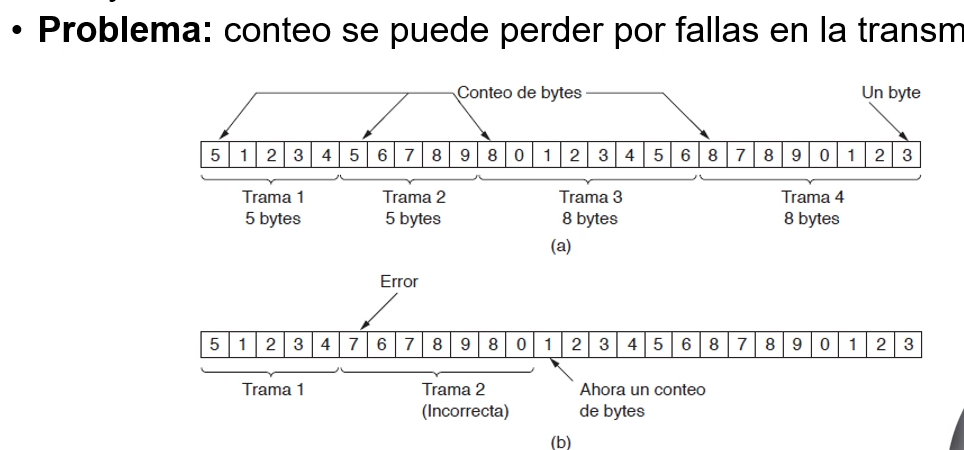
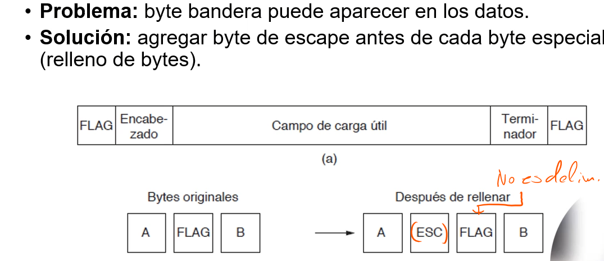
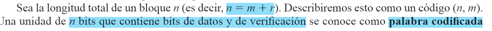
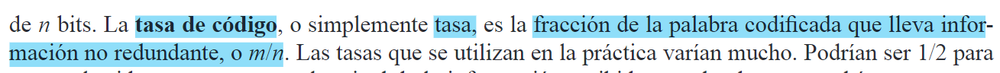
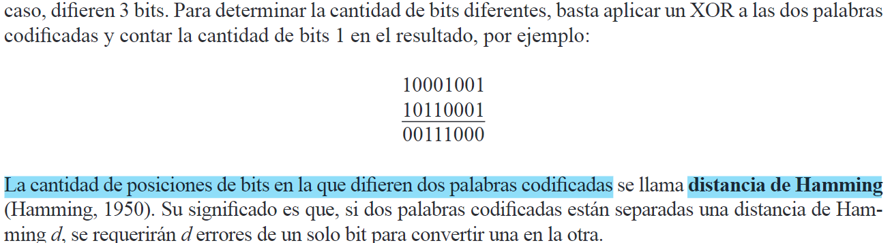
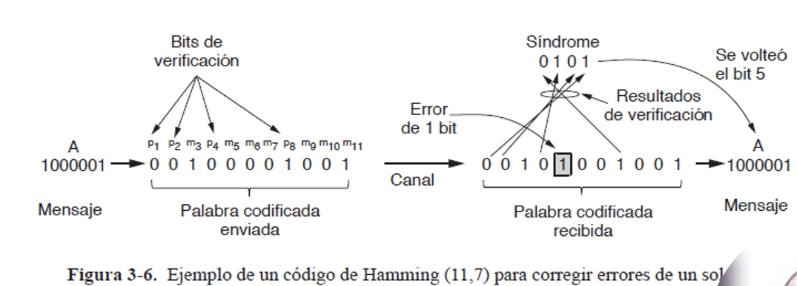
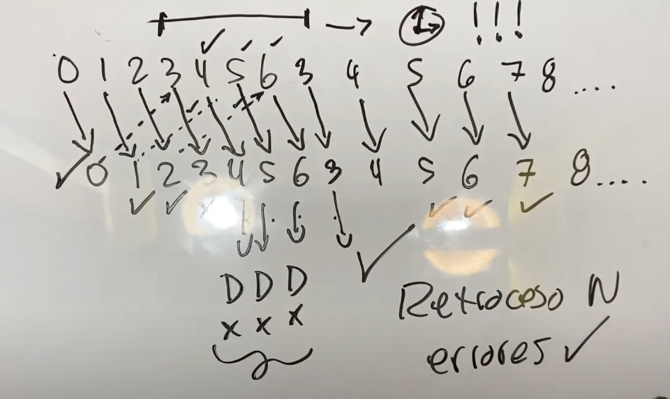

# C3: Capa de enlace de datos (OSI 2)

1. ¿Qué es una trama?
2. ¿Cuál es la propiedad de un canal que lo asemeja a un
alambre?
3. ¿Qué factores debe de tomar en cuenta un protocolo de 
capa de transmisión de datos?
4. ¿Qué funciones cumple la capa de enlace de datos?
5. ¿Para qué sirve una trama?
6. Partes de la trama.
7. ¿Cuál es el servicio principal que ofrece la capa de 
enlace a la capa de red?
8. ¿Qué es un proceso en capa de Red?
9. Diferencia entre transmisión real y virtual.
(en el libro)
10. Explique los tres servicios que usualmente 
ofrece la capa de enlace de datos. Brinde ejemplos
11. ¿Cuándo es más apropiado usar alguno de los tres?
12. Ordene los servicios de más a menos sofisticado.
13. ¿Quién se encarga de corregir errores en la transmisión
de bits que hace la capa de transporte y cómo?
14. Mencione y explique los 4 métodos para dividir el flujo
de bits en tramas.
15. ¿Qué el relleno de bytes y bits y para que funcionan?
16. ¿Cómo se puede asegurar que los datos lleguen de forma correcta y en un orden correcto?
17. ¿Cómo hacer que si tengo un emisor rápido y un receptor lento esto no sea un problema?
18. Explique con sus propias palabras, cuál es la diferencia entre el modelo OSI y el modelo TCP/IP a nivel de la capa de enlace de datos.
R/ La capa de enlace de datos en el modelo TCP/IP no está tan claramente definida como en el modelo OSI, pues además de las funciones de 
la capa de enlace de datos incluye todas las funciones relacionadas con la interacción con la red física, incluyendo aspectos de la capa 
física del modelo OSI. En cambio la capa de enlace de datos en el modelo OSI se encarga exclusivamente de la transferencia de datos entre
 entidades adyacentes de una red y proporciona métodos para detectar y posiblemente corregir errores que puedan ocurrir en la capa física.
 
1. Servicio sin conexión, ni confirmación de recepción: En este no hace falta que el emisor se tenga una conexión (y por ende tampoco que la libere) con el receptor, tampoco necesita la confirmación del receptor para seguir enviando tramas independientes. Se suele usar en tráfico en tiempo real o cuando hay una tasa de error muy baja.

2. Servicio sin conexión, con confirmación de recepción: Tampoco hace falta establecer ni liberar ninguna conexión física entre el emisor y el receptor, pero si es necesario que el receptor confirme la recepción de cada trama enviada por el emisor. Se usa en Sistemas que no son confiables, como los inalámbricos por ejemplo.

3. Servicio orientado a la conexión: Este también requiere de una confirmación de recepción, pero además requiere que previo a ningún tipo de envío de tramas haya una conexión física entre emisor y receptor. Es el servicio más sofisticado de los tres, pues enumera las tramas para poder garantizar que estas lleguen completas y en el orden correcto. Se usa en Sistemas no confiables o con enlaces muy distantes entre sí (como los de los satélites).

El problema principal es conseguir que las tramas de datos lleguen correctamente a receptor, es decir, que lleguen completas, en el orden correcto y que no lleguen repetidas. Para esto se combinan varias técnicas.
Se puede tener una confirmación de recepción para que el emisor sepa qué llegó y qué no, pero esta confirmación se podría perder, entonces para que el emisor pueda seguir sin requerir de esta confirmación, se puede tener un temporizador, cuando se acaba el tiempo, si el emisor no obtiene respuesta entonces vuelve a enviar la trama asumiendo que el receptor nunca la recibió a causa de ruido. Esto puede ocasionar que el receptor reciba más de una vez la misma trama en caso de que la asumpción del emisor fuese errónea, para solucionar esto se pueden enumerar la secuencia de tramas, para que en caso de recibir dos o más veces la misma trama, el receptor la descarte antes de pasarla a la capa de Red.

19. Explique con sus propias palabras, que quiere decir cuándo nos referimos a que un emisor rápido puede generar un problema de congestión al comunicarse con un receptor lento.
R/ Que aunque se envíen perfectamente todas las tramas, si el emisor es muy rápido para el receptor, estas tramas se podrían perder inevitablemente porque el receptor no le puede seguir el ritmo al emisor

20. ¿Cuáles son las dos estrategias principales para la detección de errores?
R/

En sistemas que son muy confiables basta con saber si hubo un error y que el emisor vuelva a mandar la trama, así que en ese caso se usan códigos de detección de errores. Cuando son sistemas que generan muchos errores, es mejor utilizar códigos de corrección de errores y que el receptor corrija los errores, así no se pierde tanto ancho de bando en reenviar las tramas.

Consisten en agregar un bit adicional, conocido como bit de paridad, a un conjunto de datos. Este bit se calcula para que el número total de bits "1" en el conjunto, incluyendo el bit de paridad, sea par (paridad par) o impar (paridad impar). Por ejemplo, si los datos originales tienen un número impar de bits "1", se agrega un bit de paridad "1" para hacer que el número total sea par, y viceversa. Durante la transmisión, se envían los datos junto con el bit de paridad. Al recibir los datos, el receptor verifica la paridad sumando todos los bits.

En el contexto de la capa de enlace de datos, explique con sus propias palabras, ¿en qué consisten los protocolos de ventana deslizante?

• Tres tipos de servicios:
• Servicio sin conexión ni confirmación de recepción. Tasa de error baja
• Ejemplo: Ethernet
• Servicio sin conexión con confirmación de recepción. Canales no confiables
• Ejemplo. 802.11 WIFI
• Servicio orientado a conexión con confirmación de recepción. Aplicaciones donde se asegura.
• Transferencias pasan por tres fases distintas:

Para dividir los datos en tramas, se tiene cuatro métodos:
• Conteo de bytes.
• Bytes bandera con relleno de bytes.
• Bits bandera con relleno de bits: un bit 0 entre cada 5 unos
• Violaciones de codificación de la capa física.

 se añade un ESC si hay un ESC o FLAG en medio de los datos.

• Dos estrategias básicas para manejar los errores
• Códigos de corrección de errores -+ se incluye suficiente
información redundante para que el receptor pueda deducir cuáles
debieron ser los datos transmitidos.
• Códigos de detección de errores se incluye sólo suficiente
redundancia para permitir que el receptor sepa que ha ocurrido un
error (pero no qué error) y entonces solicite una retransmisión.
• Medios confiables -s» códigos de detección de errores
• Medios ruidosos -5 redundancia en cada bloque

Analizaremos cuatro códigos de corrección de errores;
1 Códigos de Hamming.
Códigos convolucionales binarios,
2.
Códigos de Reed-Solomon.
3.
Códigos de verificación de paridad de baja densidad.
4

• Tres códigos de detección de errores distintos:
• Paridad.
• Sumas de verificación.
• Comprobaciones de Redundancia Cíclica (CRC).

ventana deslizante de un bit. Una sola trama a la vez, se pierde tiempo y no se puede tener una trama inicial al mismo tiempo.

Retroceso N: 

PPP