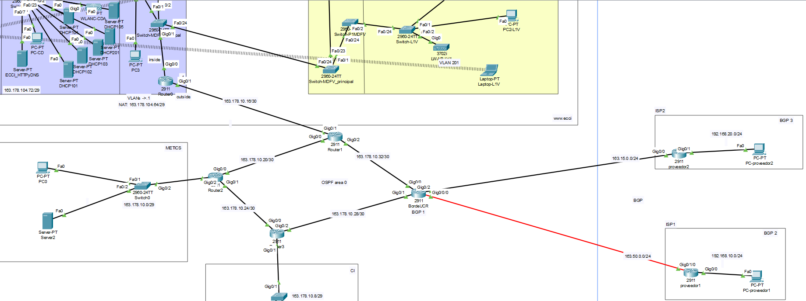
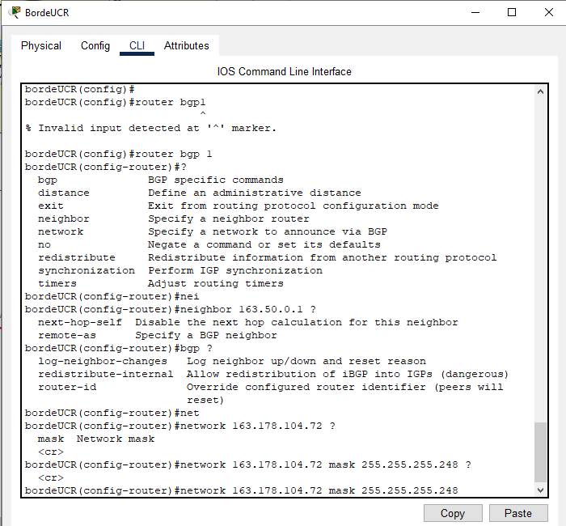
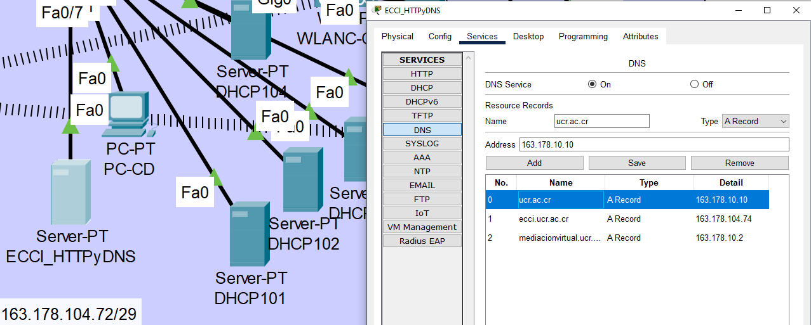
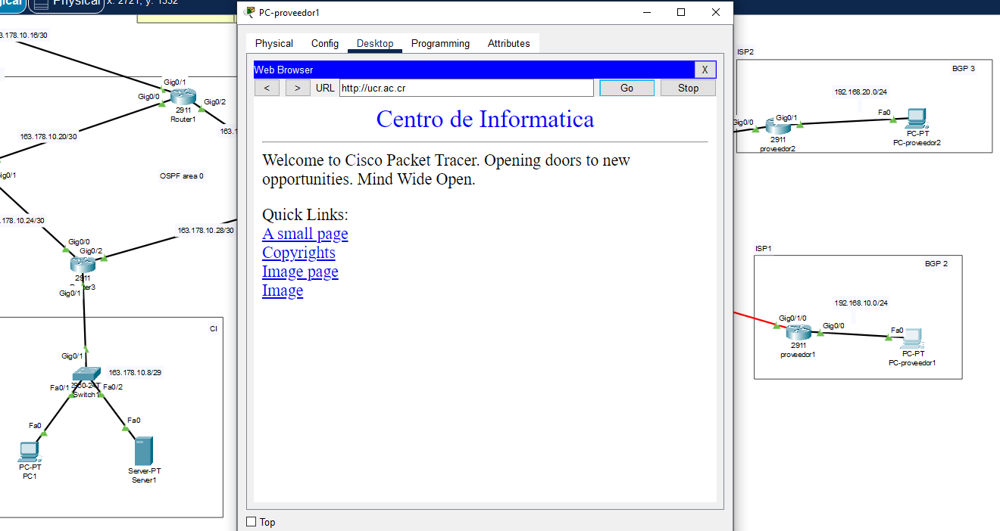
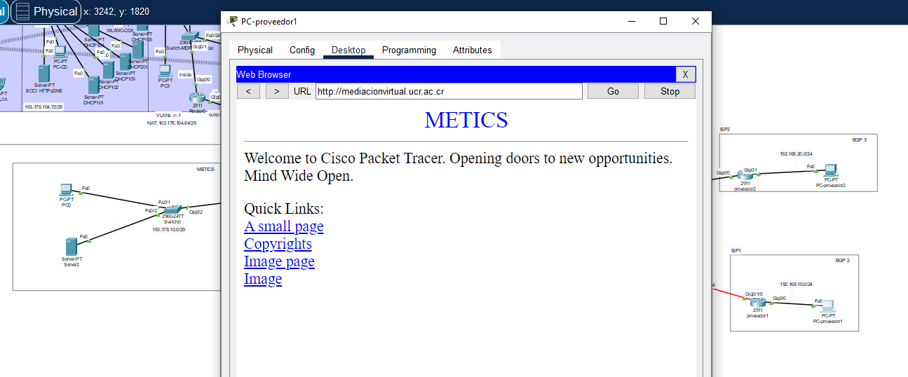
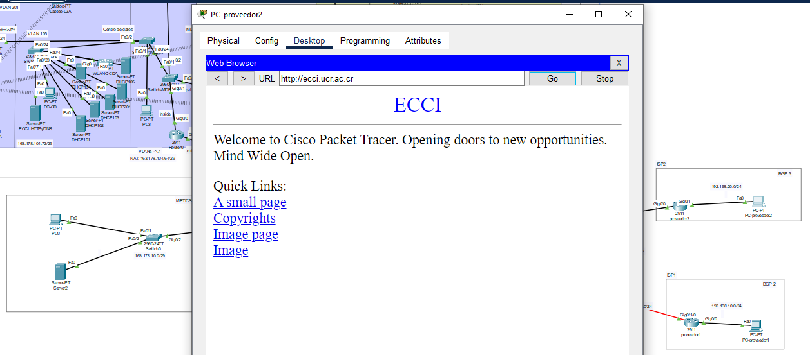
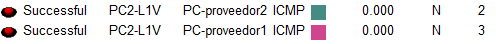

Universidad de Costa Rica  
CI-0121 Redes de comunicación de datos  
Grupo 3  
Docente: Mag. José Antonio Brenes Carranza  
Andrés Quesada González C16105  

# Proyecto Práctico - Etapa 3

## Descripción de la Red (solo los cambios respecto a la anterior)

Se toma a la UCR como un S.A. que incluye a las redes de la ECCI, Centro de Informática y METICS los cuales están enrutados mediante el uso de OSPF, en esta ocasión el objetivo el conectar a este S.A. con otros dos S.A. los cuales representan a dos proveedores distintos, esta conexión se establecerá mediante el uso de BGP con el que se quiere localizar al S.A. UCR fuera de sí mismo para poder acceder a los servidores de ucr.ac.cr, mediacionvirtual.ucr.ac.cr y ecci.ucr.ac.cr (los cuales son dominios establecidos con el uso de DNS para poder ubicar a los servidores que está en la UCR sin necesidad de tener sus  direcciones IP) desde fuera de la UCR.

Estos proveedores pueden acceder a los servidores de la UCR pero no pueden accederse entre ellos pese a saber de la "existencia" del otro. Dentro de estos proveedores se tienen redes que solo existen para poder verificar el acceso a los servidores, estas redes so 192.168.10.0/24 para el proveedor 1 y 192.168.20.0/24 para el proveedor 2. También estos proveedores son vistos como "vecinos" en 163.15.0.0/24 y 163.50.0.0/24 respectivamente de cara al router de borde de la UCR el cual es el "antiguo" router 4 que se tenía en OSPF en la etapa anterior.

## Componentes agregados a la Red

* Routers: Dos routers uno por cada proveedor con fines representativos.
* PCs: Un PC por cada proveedor para poder verificar que se conectan con los servidores de la UCR.
* Se remueve al servidor 200.0.0.2. 

### La Red descrita se ve en la siguiente imágen.



## Descripción de las principales instrucciones

### BGP

```
router bgp <sa_id>
  network <direccion_ip> mask <subnet_mask>
  neighbor <direccion_ip> remote-as <sa_remoto>
  redistribute ospf 1
```

router bgp `<sa_id>` inicia la configuración de bgp con la identificación de Sistema Autónomo (S.A.). El primer comando de la configuración anuncia la red que quiera presentar ese S.A. por eso el "network", mientras que con "neighbor" se establece una relación de vecindad BGP con el router cuyo IP es `<direccion_ip>` y que pertenece al Sistema Autónomo `<sa_remoto>`.  
Para que esta configuración de BGP sepa a dónde ir a ya dentro del S.A. se le da la configuración que se hizo en OSPF con el último comando de la configuración.
```
router ospf <id>
  redistribute bgp <sa_id> subnets
```
Para terminar esa última parte, hay que volver a la configuración de OSPF que está en la UCR para distribuir en todas las subredes la configuración que se hizo en BGP para que también se sepa volver hacia afuera de la UCR.

```
access-list 100 deny ip 192.168.20.0 0.0.0.255 192.168.10.0 0.0.0.255
access-list 100 deny ip 192.168.10.0 0.0.0.255 192.168.20.0 0.0.0.255
access-list 100 permit ip any any

interface <nombre_de_interfaz>
 ip access-group 100 in
 ip access-group 100 out
```
Para lograr que los proveedores pudieran acceder a la UCR pero no accederse entre ellos se hicieron estas access-list dentro de la configuración del router "bordeUCR". Esta ACL niega conexiones entre las redes internas de los proveedores pero permiten cualquier otra para evitar bloqueos no deseados.

* Nota: Usar access-list no es la manera correcta, pero no encontré otra forma de hacerlo que no fuera con "distribute-list", "prefix-list" o "route-map" los cuales son comando que no están disponibles en la versión gratuita de Packet Tracer que se ofrece en: https://skillsforall.com/resources/lab-downloads?userLang=es-XL&courseLang=en-US. 
* 

La forma correcta se explica en: 
* https://www.cisco.com/c/en/us/support/docs/ip/border-gateway-protocol-bgp/13750-22.html
* https://www.cisco.com/c/es_mx/support/docs/ip/border-gateway-protocol-bgp/217964-configure-sample-for-bgp-with-two-differ.html

### DNS

Para DNS se utilizó el mismo servidor que contiene la página web de la ECCI, de la siguiente manera:

Como se puede ver se establecen los siguientes dominios:
* ucr.ac.cr - 163.178.10.10
* ecci.ucr.ac.cr - 163.178.104.74
* mediaciónvirtual.ucr.ac.cr - 163.178.10.2
  
Para que el DNS funcionara se tuvo que ampliar la ACL del router de la ECCI:
```
access-list 100 permit udp any any eq domain
access-list 100 permit udp any eq domain any
```
De esta forma se permite tráfico UDP para DNS de adentro hacia afuera y de fuera hacia adentro.


## Dump de intrucciones sobre routers

**bordeUCR**
```
Current configuration : 1493 bytes
!
version 15.1
no service timestamps log datetime msec
no service timestamps debug datetime msec
no service password-encryption
!
hostname bordeUCR
!
!
!
!
!
!
!
!
ip cef
no ipv6 cef
!
!
!
!
license udi pid CISCO2911/K9 sn FTX1524ZP8A-
!
!
!
!
!
!
!
!
!
!
!
spanning-tree mode pvst
!
!
!
!
!
!
interface GigabitEthernet0/0
 ip address 163.178.10.33 255.255.255.252
 duplex auto
 speed auto
!
interface GigabitEthernet0/1
 ip address 163.178.10.30 255.255.255.252
 duplex auto
 speed auto
!
interface GigabitEthernet0/2
 ip address 163.15.0.3 255.255.255.0
 ip access-group 100 in
 ip access-group 100 out
 duplex auto
 speed auto
!
interface GigabitEthernet0/0/0
 ip address 163.50.0.3 255.255.255.0
 ip access-group 100 in
 ip access-group 100 out
!
interface Vlan1
 no ip address
 shutdown
!
router ospf 1
 log-adjacency-changes
 redistribute bgp 1 subnets 
 network 163.178.10.28 0.0.0.3 area 0
 network 163.178.10.32 0.0.0.3 area 0
 default-information originate
!
router bgp 1
 bgp log-neighbor-changes
 no synchronization
 neighbor 163.15.0.1 remote-as 3
 neighbor 163.50.0.1 remote-as 2
 network 163.178.104.64 mask 255.255.255.248
 network 163.178.104.72 mask 255.255.255.248
 redistribute ospf 1 
!
ip classless
!
ip flow-export version 9
!
!
access-list 100 deny ip 192.168.20.0 0.0.0.255 192.168.10.0 0.0.0.255
access-list 100 deny ip 192.168.10.0 0.0.0.255 192.168.20.0 0.0.0.255
access-list 100 permit ip any any
!
!
!
!
!
line con 0
!
line aux 0
!
line vty 0 4
 login
!
!
!
end
```


**proveedor 1 (p1)**
```
Current configuration : 946 bytes
!
version 15.1
no service timestamps log datetime msec
no service timestamps debug datetime msec
no service password-encryption
!
hostname p1
!
!
!
!
!
!
!
!
no ip cef
no ipv6 cef
!
!
!
!
license udi pid CISCO2911/K9 sn FTX1524YREL-
!
!
!
!
!
!
!
!
!
!
!
spanning-tree mode pvst
!
!
!
!
!
!
interface GigabitEthernet0/0
 ip address 192.168.10.1 255.255.255.0
 duplex auto
 speed auto
!
interface GigabitEthernet0/1
 no ip address
 duplex auto
 speed auto
 shutdown
!
interface GigabitEthernet0/2
 no ip address
 duplex auto
 speed auto
 shutdown
!
interface GigabitEthernet0/0/0
 no ip address
 shutdown
!
interface GigabitEthernet0/1/0
 ip address 163.50.0.1 255.255.255.0
!
interface Vlan1
 no ip address
 shutdown
!
router bgp 2
 bgp log-neighbor-changes
 no synchronization
 neighbor 163.50.0.3 remote-as 1
 network 192.168.10.0
!
ip classless
!
ip flow-export version 9
!
!
!
!
!
!
!
line con 0
!
line aux 0
!
line vty 0 4
 login
!
!
!
end
```

**proveedor 2 (p2)**
```
Current configuration : 827 bytes
!
version 15.1
no service timestamps log datetime msec
no service timestamps debug datetime msec
no service password-encryption
!
hostname p2
!
!
!
!
!
!
!
!
ip cef
no ipv6 cef
!
!
!
!
license udi pid CISCO2911/K9 sn FTX15245416-
!
!
!
!
!
!
!
!
!
!
!
spanning-tree mode pvst
!
!
!
!
!
!
interface GigabitEthernet0/0
 ip address 163.15.0.1 255.255.255.0
 duplex auto
 speed auto
!
interface GigabitEthernet0/1
 ip address 192.168.20.1 255.255.255.0
 duplex auto
 speed auto
!
interface GigabitEthernet0/2
 no ip address
 duplex auto
 speed auto
 shutdown
!
interface Vlan1
 no ip address
 shutdown
!
router bgp 3
 bgp log-neighbor-changes
 no synchronization
 neighbor 163.15.0.3 remote-as 1
 network 192.168.20.0
!
ip classless
!
ip flow-export version 9
!
!
!
!
!
!
!
line con 0
!
line aux 0
!
line vty 0 4
 login
!
!
!
end
```

## Pruebas

**Máquina de un proveedor accede a los dominios de la UCR**




**Ping entre máquina de la ECCI hacia la máquina de los proveedores**


**Ping entre proveedores**

